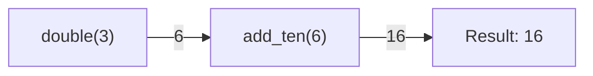
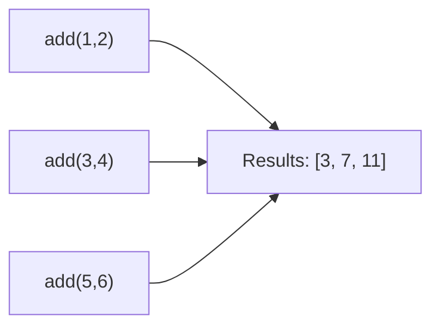
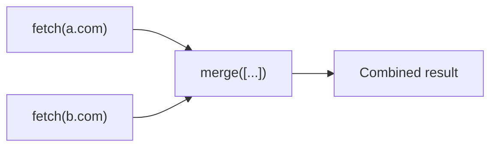

# Canvas (Workflows)

::: quickq.canvas

Canvas primitives for composing task workflows. Import directly from the package:

```python
from quickq import chain, group, chord
```

---

## Signature

A frozen task call spec — describes *what* to call and *with what arguments*, without executing it.

### Creating Signatures

```python
# Mutable signature — receives previous result in chains
sig = add.s(2, 3)

# Immutable signature — ignores previous result in chains
sig = add.si(2, 3)
```

### Fields

| Field | Type | Description |
|---|---|---|
| `task` | `TaskWrapper` | The task to call |
| `args` | `tuple` | Positional arguments |
| `kwargs` | `dict` | Keyword arguments |
| `options` | `dict` | Enqueue options (priority, queue, etc.) |
| `immutable` | `bool` | If `True`, ignores previous result in chains |

### `sig.apply()`

```python
sig.apply(queue: Queue | None = None) -> JobResult
```

Enqueue this signature immediately. If `queue` is `None`, uses the task's parent queue.

```python
sig = add.s(2, 3)
job = sig.apply()
print(job.result(timeout=10))  # 5
```

### Mutable vs Immutable

In a [`chain`](#chain), the previous task's return value is **prepended** to a mutable signature's args:

```python
# add.s(10) in a chain where previous step returned 5:
# → add(5, 10) = 15

# add.si(2, 3) in a chain:
# → add(2, 3) = 5  (always, regardless of previous result)
```

---

## chain

Execute signatures sequentially, piping each result to the next.

### Constructor

```python
chain(*signatures: Signature)
```

Requires at least one signature.

### `chain.apply()`

```python
chain.apply(queue: Queue | None = None) -> JobResult
```

Execute the chain by enqueuing and waiting for each step sequentially. Returns the [`JobResult`](result.md) of the **last** step.

Each step's return value is prepended to the next mutable signature's args. Immutable signatures (`task.si()`) receive their args as-is.

```python
@queue.task()
def double(x):
    return x * 2

@queue.task()
def add_ten(x):
    return x + 10

# double(3) → 6, then add_ten(6) → 16
result = chain(double.s(3), add_ten.s()).apply()
print(result.result(timeout=10))  # 16
```



---

## group

Execute signatures in parallel and collect all results.

### Constructor

```python
group(*signatures: Signature)
```

Requires at least one signature.

### `group.apply()`

```python
group.apply(queue: Queue | None = None) -> list[JobResult]
```

Enqueue all signatures and return a list of [`JobResult`](result.md) handles. Jobs run concurrently across available workers.

```python
jobs = group(
    add.s(1, 2),
    add.s(3, 4),
    add.s(5, 6),
).apply()

results = [j.result(timeout=10) for j in jobs]
print(results)  # [3, 7, 11]
```



---

## chord

Run a group in parallel, then pass all results to a callback.

### Constructor

```python
chord(group_: group, callback: Signature)
```

| Parameter | Type | Description |
|---|---|---|
| `group_` | `group` | The group of tasks to run in parallel |
| `callback` | `Signature` | The task to call with all collected results |

### `chord.apply()`

```python
chord.apply(queue: Queue | None = None) -> JobResult
```

Execute the group, wait for all results, then run the callback with the list of results prepended to its args (unless immutable). Returns the [`JobResult`](result.md) of the callback.

```python
@queue.task()
def fetch(url):
    return requests.get(url).text

@queue.task()
def merge(results):
    return "\n".join(results)

result = chord(
    group(fetch.s("https://a.com"), fetch.s("https://b.com")),
    merge.s(),
).apply()

combined = result.result(timeout=30)
```



---

## Complete Example

An ETL pipeline using all three primitives:

```python
from quickq import Queue, chain, group, chord

queue = Queue()

@queue.task()
def extract(source):
    return load_data(source)

@queue.task()
def transform(data):
    return clean(data)

@queue.task()
def aggregate(results):
    return merge_datasets(results)

@queue.task()
def load(data):
    save_to_warehouse(data)

# Extract from 3 sources in parallel, transform each,
# aggregate all results, then load
pipeline = chain(
    chord(
        group(
            chain(extract.s("db"), transform.s()),
            chain(extract.s("api"), transform.s()),
            chain(extract.s("csv"), transform.s()),
        ),
        aggregate.s(),
    ),
    load.s(),
)

result = pipeline.apply(queue)
```
