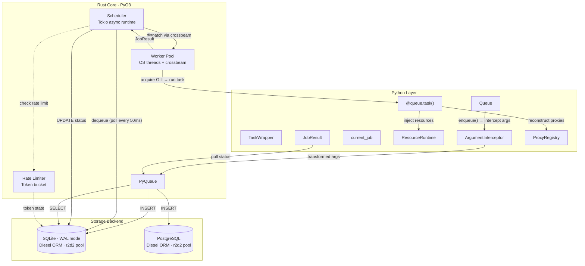
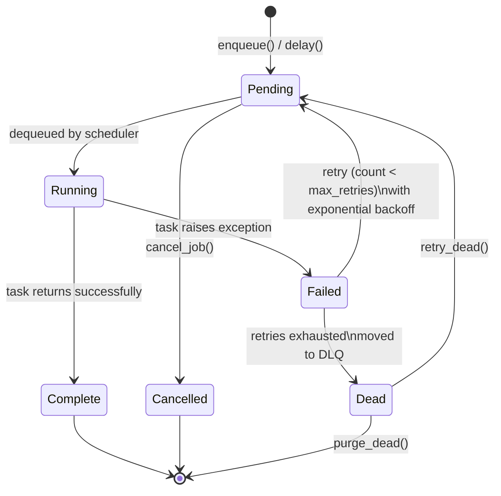
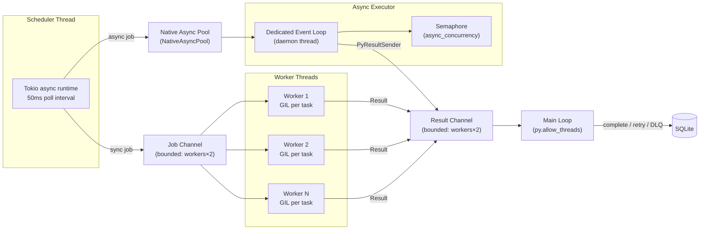
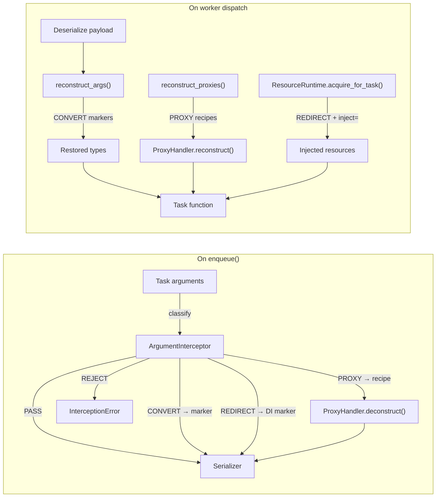

# Architecture

taskito is a hybrid Python/Rust system. Python provides the user-facing API. Rust handles all the heavy lifting: storage, scheduling, dispatch, rate limiting, and worker management.

## Overview



## Job Lifecycle



**Status codes:**

| Status | Integer | Description |
|---|---|---|
| Pending | 0 | Waiting to be picked up |
| Running | 1 | Currently executing |
| Complete | 2 | Finished successfully |
| Failed | 3 | Last attempt failed (may retry) |
| Dead | 4 | All retries exhausted, in DLQ |
| Cancelled | 5 | Cancelled before execution |

## Worker Pool



**Key design decisions:**

- **OS threads, not Python threads**: Sync workers are Rust `std::thread` threads. The GIL is only acquired when calling Python task code.
- **Bounded channels**: Both job and result channels are bounded to `workers × 2` to provide backpressure.
- **GIL isolation**: Each sync worker acquires the GIL independently using `Python::with_gil()`. The scheduler and result handler release the GIL via `py.allow_threads()`.
- **Native async dispatch**: `async def` tasks bypass the thread pool entirely. A `NativeAsyncPool` sends them to a dedicated `AsyncTaskExecutor` running on a Python daemon thread. `PyResultSender` (a `#[pyclass]`) bridges results back into the Rust scheduler.
- **Context isolation**: Sync tasks use `threading.local` for `current_job`; async tasks use `contextvars.ContextVar`, which is properly scoped across `await` boundaries and isolated between concurrent coroutines.

## Storage Layer

### SQLite Configuration

| Pragma | Value | Why |
|---|---|---|
| `journal_mode` | WAL | Concurrent reads while writing |
| `busy_timeout` | 5000ms | Wait on lock contention instead of failing |
| `synchronous` | NORMAL | Fast writes, safe with WAL |
| `journal_size_limit` | 64MB | Prevent unbounded WAL file growth |

### Database Schema

**6 tables:**

```sql
-- Core job storage
jobs (id, queue, task_name, payload, status, priority,
      created_at, scheduled_at, started_at, completed_at,
      retry_count, max_retries, result, error, timeout_ms,
      unique_key, progress, metadata,
      cancel_requested, expires_at, result_ttl_ms)

-- Dead letter queue
dead_letter (id, original_job_id, queue, task_name,
             payload, error, retry_count, failed_at, metadata,
             priority, max_retries, timeout_ms, result_ttl_ms)

-- Token bucket rate limiting
rate_limits (key, tokens, max_tokens, refill_rate, last_refill)

-- Cron-scheduled tasks
periodic_tasks (name, task_name, cron_expr, args, kwargs,
                queue, enabled, last_run, next_run)

-- Per-attempt error tracking
job_errors (id, job_id, attempt, error, failed_at)

-- Worker heartbeat tracking
workers (worker_id, last_heartbeat, queues, status)
```

**Key indexes:**

- `idx_jobs_dequeue`: `(queue, status, priority DESC, scheduled_at)` — fast dequeue
- `idx_jobs_status`: `(status)` — fast stats queries
- `idx_jobs_unique_key`: partial unique index on `unique_key` where status is pending/running
- `idx_job_errors_job_id`: `(job_id)` — fast error history lookup

### Connection Pooling

Diesel's `r2d2` connection pool with up to 8 connections (SQLite) or 10 connections (Postgres). In-memory databases use a single connection (SQLite `:memory:` is per-connection).

### Postgres Configuration

taskito also supports PostgreSQL as an alternative storage backend. See the [Postgres Backend guide](guide/postgres.md) for full details.

Key differences from the SQLite storage layer:

- **Connection pooling**: `r2d2` pool with a default of 10 connections (vs. 8 for SQLite)
- **Schema isolation**: All tables are created inside a configurable PostgreSQL schema (default: `taskito`), with `search_path` set on each connection
- **Additional tables**: The Postgres backend creates 11 tables (vs. 6 for SQLite), adding `job_dependencies`, `task_metrics`, `replay_history`, `task_logs`, and `circuit_breakers`
- **Concurrent writes**: No single-writer constraint — multiple workers can write simultaneously

## Scheduler Loop

The scheduler runs in a dedicated Tokio single-threaded async runtime:

```
loop {
    sleep(50ms) or shutdown signal

    // Try to dequeue and dispatch a job
    try_dispatch()

    // Every ~100 iterations (~5s): reap timed-out jobs
    reap_stale()

    // Every ~60 iterations (~3s): check periodic tasks
    check_periodic()

    // Every ~1200 iterations (~60s): auto-cleanup old jobs
    auto_cleanup()
}
```

### Dispatch Flow

1. `dequeue_from()` — atomically SELECT + UPDATE (pending → running) within a transaction
2. Check rate limit — if over limit, reschedule 1s in the future
3. Send job to worker pool via crossbeam channel
4. Worker executes task, sends result back
5. `handle_result()` — mark complete, schedule retry, or move to DLQ

## Resource System

The resource system is a three-layer Python pipeline that runs entirely outside Rust:



**Layer 1 — Argument Interception**: The `ArgumentInterceptor` walks every argument before serialization, applying the strategy registered for its type. CONVERT types are transformed to JSON-safe markers. REDIRECT types are replaced with a DI placeholder. PROXY types are deconstructed by their handler. REJECT types raise an error in strict mode.

**Layer 2 — Worker Resource Runtime**: `ResourceRuntime` initializes all registered resources at worker startup in topological dependency order. At task dispatch time it injects the requested resources (via `inject=` or `Inject["name"]` annotation) as keyword arguments. Task-scoped resources are acquired from a semaphore pool and returned after the task finishes.

**Layer 3 — Resource Proxies**: `ProxyHandler` implementations know how to deconstruct live objects (file handles, HTTP sessions, cloud clients) into a JSON-serializable recipe, and how to reconstruct them on the worker before the task function is called. Recipes are optionally HMAC-signed for tamper detection.

## Serialization

taskito uses a pluggable serializer for task arguments and results. The default is `CloudpickleSerializer`, which supports lambdas, closures, and complex Python objects.

```python
from taskito import Queue, JsonSerializer

# Use JSON for simpler, cross-language payloads
queue = Queue(serializer=JsonSerializer())
```

**Built-in serializers:**

| Serializer | Format | Best for |
|---|---|---|
| `CloudpickleSerializer` (default) | Binary (pickle) | Complex Python objects, lambdas, closures |
| `JsonSerializer` | JSON | Simple types, cross-language interop, debugging |

**Custom serializers** implement the `Serializer` protocol (`dumps(obj) -> bytes`, `loads(data) -> Any`).

- **Arguments**: `serializer.dumps((args, kwargs))` — stored as BLOB in `payload`
- **Results**: `serializer.dumps(return_value)` — stored as BLOB in `result`
- **Periodic task args**: Serialized at registration time, stored as BLOBs in `periodic_tasks.args`

