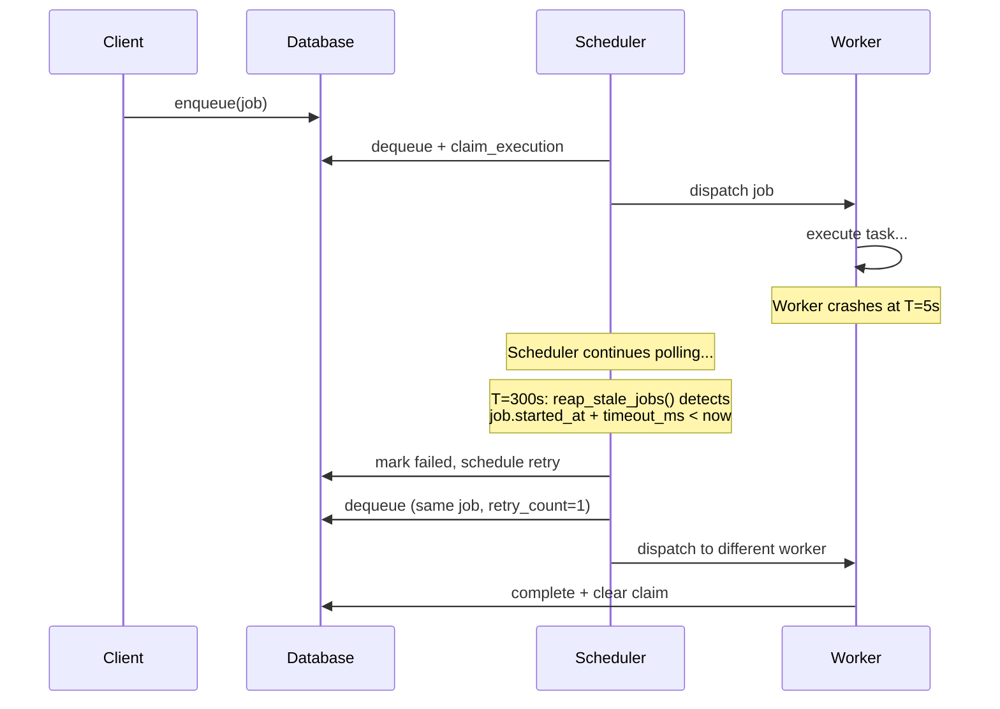

# Failure Model

Taskito provides **at-least-once delivery**. Here's what happens when things go wrong.

## Worker crash mid-task

The job stays in `running` status. The scheduler's stale reaper detects it after `timeout_ms` elapses, marks it failed, and retries (if retries remain) or moves to the dead letter queue. No manual intervention needed.

## Parent process crash

All worker threads stop. Jobs in `running` stay in that state until the next worker starts, when the stale reaper picks them up. Jobs in `pending` are unaffected — they'll be dispatched normally on restart.

## Database unavailable

Scheduler polls fail silently (logged via `log::error!`). No new jobs are dispatched. In-flight jobs complete normally — results are cached in memory until the database becomes available.

## Network partition (Postgres/Redis)

Same behavior as database unavailable. The scheduler retries on the next poll cycle (default: every 50ms). Connection pools handle reconnection automatically.

## Duplicate execution

`claim_execution` prevents two workers from picking up the same job simultaneously. But if a worker crashes *after* starting execution, the job will be retried — potentially executing the same task twice. Design tasks to be [idempotent](../guide/reliability/guarantees.md) to handle this safely.

## Recovery timeline

## Partial writes

If a task completes successfully but the result write to the database fails (e.g., database full, connection lost), the job stays in `running` status. The stale reaper eventually marks it failed and retries it. The task will execute again — make sure it's [idempotent](../guide/reliability/guarantees.md).

## Jobs without timeouts

!!! warning
    If a job has no `timeout_ms` set and the worker crashes, the job stays in `running` **forever**. The stale reaper only detects jobs that have exceeded their timeout. Always set a timeout on production tasks.
