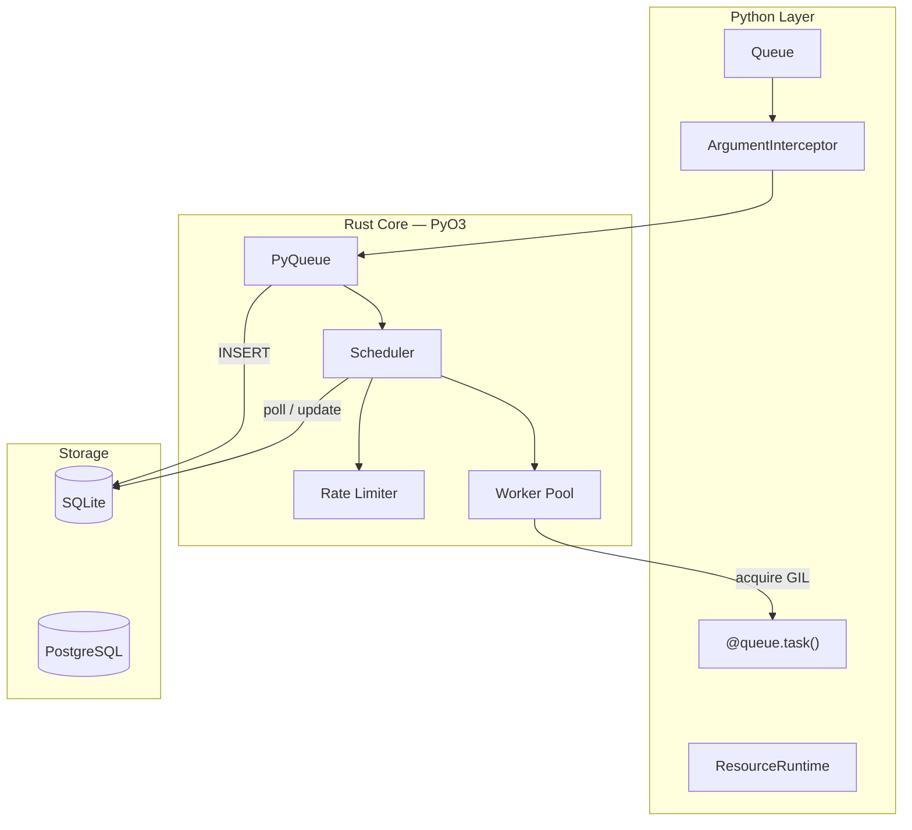

# Architecture

taskito is a hybrid Python/Rust system. Python provides the user-facing API. Rust handles all the heavy lifting: storage, scheduling, dispatch, rate limiting, and worker management.

## Section overview

| Page | What it covers |
|---|---|
| [Job Lifecycle](job-lifecycle.md) | State machine, status codes, transitions |
| [Worker Pool](worker-pool.md) | Thread architecture, async dispatch, GIL management |
| [Storage Layer](storage.md) | SQLite pragmas, schema, indexes, Postgres differences |
| [Scheduler](scheduler.md) | Poll loop, dispatch flow, periodic tasks |
| [Resource System](resources.md) | Argument interception, DI, proxy reconstruction |
| [Failure Model](failure-model.md) | Crash recovery, duplicate execution, partial writes |
| [Serialization](serialization.md) | Pluggable serializers, format details |
