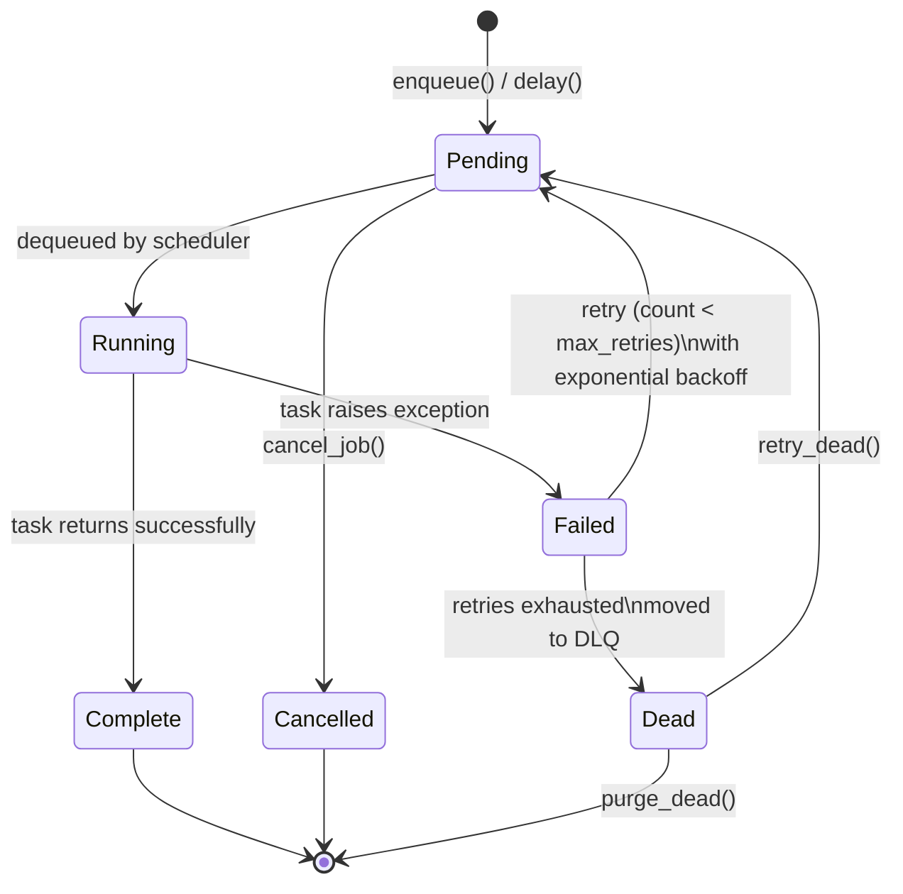

# Job Lifecycle

Every job moves through a state machine from creation to completion (or death).

## Status codes

| Status | Integer | Description |
|---|---|---|
| Pending | 0 | Waiting to be picked up |
| Running | 1 | Currently executing |
| Complete | 2 | Finished successfully |
| Failed | 3 | Last attempt failed (may retry) |
| Dead | 4 | All retries exhausted, in DLQ |
| Cancelled | 5 | Cancelled before execution |
