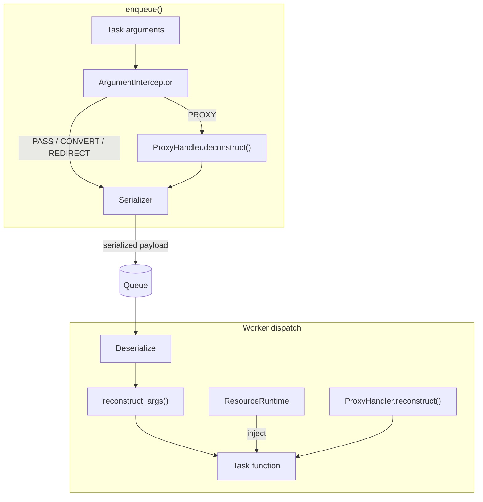

# Resource System

The resource system is a three-layer Python pipeline that runs entirely outside Rust:

**Layer 1 — Argument Interception**: The `ArgumentInterceptor` walks every argument before serialization, applying the strategy registered for its type. CONVERT types are transformed to JSON-safe markers. REDIRECT types are replaced with a DI placeholder. PROXY types are deconstructed by their handler. REJECT types raise an error in strict mode.

**Layer 2 — Worker Resource Runtime**: `ResourceRuntime` initializes all registered resources at worker startup in topological dependency order. At task dispatch time it injects the requested resources (via `inject=` or `Inject["name"]` annotation) as keyword arguments. Task-scoped resources are acquired from a semaphore pool and returned after the task finishes.

**Layer 3 — Resource Proxies**: `ProxyHandler` implementations know how to deconstruct live objects (file handles, HTTP sessions, cloud clients) into a JSON-serializable recipe, and how to reconstruct them on the worker before the task function is called. Recipes are optionally HMAC-signed for tamper detection.
