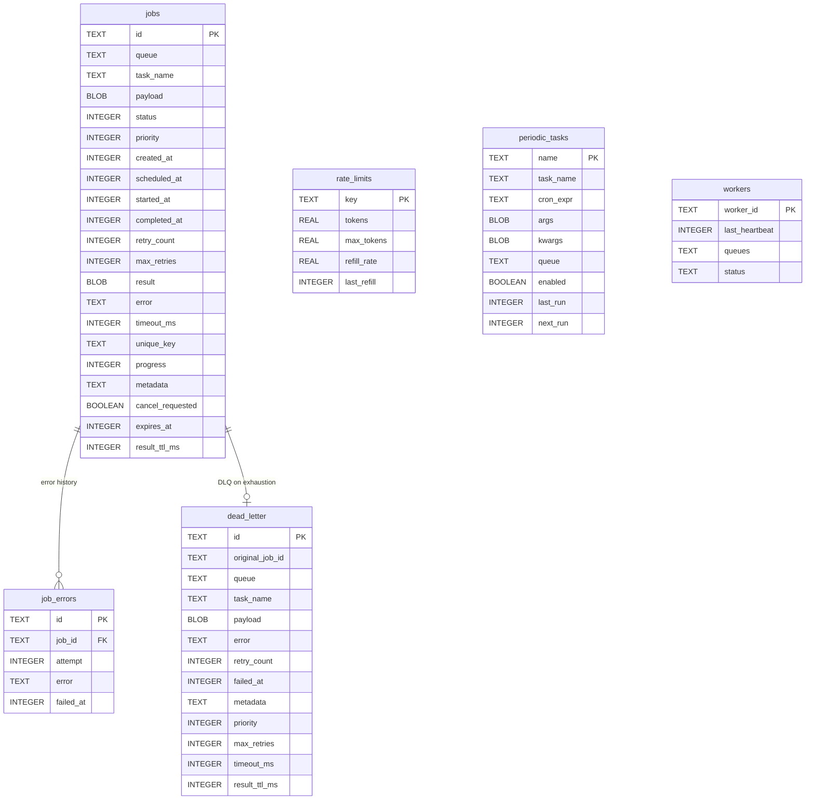

# Storage Layer

## SQLite configuration

| Pragma | Value | Why |
|---|---|---|
| `journal_mode` | WAL | Concurrent reads while writing |
| `busy_timeout` | 5000ms | Wait on lock contention instead of failing |
| `synchronous` | NORMAL | Fast writes, safe with WAL |
| `journal_size_limit` | 64MB | Prevent unbounded WAL file growth |

## Database schema

## Key indexes

- `idx_jobs_dequeue`: `(queue, status, priority DESC, scheduled_at)` — fast dequeue
- `idx_jobs_status`: `(status)` — fast stats queries
- `idx_jobs_unique_key`: partial unique index on `unique_key` where status is pending/running
- `idx_job_errors_job_id`: `(job_id)` — fast error history lookup

## Connection pooling

Diesel's `r2d2` connection pool with up to 8 connections (SQLite) or 10 connections (Postgres). In-memory databases use a single connection (SQLite `:memory:` is per-connection).

## Postgres differences

taskito also supports PostgreSQL as an alternative storage backend. See the [Postgres Backend guide](../guide/operations/postgres.md) for full details.

- **Connection pooling**: `r2d2` pool with a default of 10 connections (vs. 8 for SQLite)
- **Schema isolation**: All tables are created inside a configurable PostgreSQL schema (default: `taskito`), with `search_path` set on each connection
- **Additional tables**: The Postgres backend creates 11 tables (vs. 6 for SQLite), adding `job_dependencies`, `task_metrics`, `replay_history`, `task_logs`, and `circuit_breakers`
- **Concurrent writes**: No single-writer constraint — multiple workers can write simultaneously
