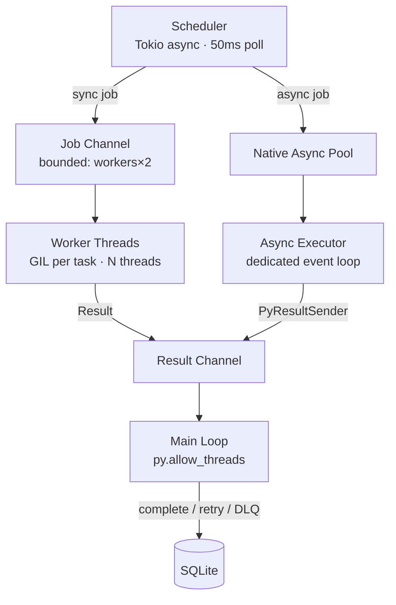

# Worker Pool

The worker pool dispatches jobs from the scheduler to Python task functions.

## Design decisions

- **OS threads, not Python threads**: Sync workers are Rust `std::thread` threads. The GIL is only acquired when calling Python task code.
- **Bounded channels**: Both job and result channels are bounded to `workers × 2` to provide backpressure.
- **GIL isolation**: Each sync worker acquires the GIL independently using `Python::with_gil()`. The scheduler and result handler release the GIL via `py.allow_threads()`.
- **Native async dispatch**: `async def` tasks bypass the thread pool entirely. A `NativeAsyncPool` sends them to a dedicated `AsyncTaskExecutor` running on a Python daemon thread. `PyResultSender` (a `#[pyclass]`) bridges results back into the Rust scheduler.
- **Context isolation**: Sync tasks use `threading.local` for `current_job`; async tasks use `contextvars.ContextVar`, which is properly scoped across `await` boundaries and isolated between concurrent coroutines.
