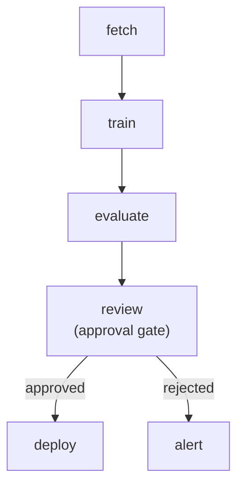
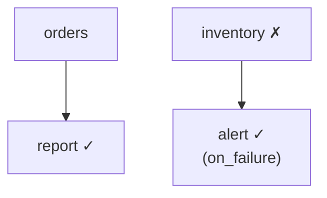

# Example: DAG Workflows

Real-world workflow patterns demonstrating fan-out, conditions, approval gates, sub-workflows, and incremental runs.

## ML Training Pipeline

A training pipeline that evaluates a model, gates deployment on accuracy, and has a rollback path.

```python
from taskito import Queue
from taskito.workflows import Workflow, WorkflowContext

queue = Queue(db_path="ml.db", workers=4)


@queue.task()
def fetch_dataset() -> dict:
    return {"rows": 50_000, "path": "/data/train.parquet"}


@queue.task()
def train_model(dataset: dict) -> dict:
    # ... training logic ...
    return {"model_id": "v3.2", "accuracy": 0.97, "loss": 0.08}


@queue.task()
def evaluate(model: dict) -> dict:
    return {"accuracy": model["accuracy"], "passed": model["accuracy"] > 0.90}


@queue.task()
def deploy(model_id: str) -> str:
    return f"deployed {model_id}"


@queue.task()
def notify_failure() -> str:
    return "sent alert: model below threshold"


def accuracy_gate(ctx: WorkflowContext) -> bool:
    return ctx.results.get("evaluate", {}).get("passed", False)


wf = Workflow(name="ml_pipeline")
wf.step("fetch", fetch_dataset)
wf.step("train", train_model, after="fetch")
wf.step("evaluate", evaluate, after="train")
wf.gate("review", after="evaluate", timeout=3600, on_timeout="reject")
wf.step("deploy", deploy, after="review")
wf.step("alert", notify_failure, after="review", condition="on_failure")
```



Usage:

```python
run = queue.submit_workflow(wf)

# After human review:
queue.approve_gate(run.id, "review")

result = run.wait(timeout=120)
print(run.visualize("mermaid"))
```

---

## Map-Reduce with Fan-Out

Process a batch of items in parallel, then aggregate results.

```python
@queue.task()
def fetch_urls() -> list[str]:
    return [
        "https://api.example.com/page/1",
        "https://api.example.com/page/2",
        "https://api.example.com/page/3",
    ]


@queue.task()
def scrape(url: str) -> dict:
    import httpx
    resp = httpx.get(url)
    return {"url": url, "status": resp.status_code, "size": len(resp.content)}


@queue.task()
def summarize(results: list[dict]) -> dict:
    total = sum(r["size"] for r in results)
    return {"pages": len(results), "total_bytes": total}


wf = Workflow(name="scrape_pipeline")
wf.step("fetch", fetch_urls)
wf.step("scrape", scrape, after="fetch", fan_out="each")
wf.step("summarize", summarize, after="scrape", fan_in="all")

run = queue.submit_workflow(wf)
result = run.wait(timeout=60)
# summarize receives [{"url": ..., "size": ...}, ...]
```

---

## Resilient Pipeline with Continue Mode

Independent branches keep running even when one fails.

```python
@queue.task(max_retries=0)
def ingest_orders() -> str:
    return "orders ingested"


@queue.task(max_retries=0)
def ingest_inventory() -> str:
    raise RuntimeError("inventory source down")


@queue.task()
def build_report() -> str:
    return "report built"


@queue.task()
def send_alert() -> str:
    return "alert sent to #data-eng"


wf = Workflow(name="daily_ingest", on_failure="continue")
wf.step("orders", ingest_orders)
wf.step("inventory", ingest_inventory)
wf.step("report", build_report, after="orders")
wf.step("alert", send_alert, after="inventory", condition="on_failure")
```



`inventory` fails, but `orders → report` runs to completion. `alert` fires because its predecessor failed.

---

## Multi-Region ETL with Sub-Workflows

Compose reusable pipelines as sub-workflow steps.

```python
@queue.task()
def extract(region: str) -> list:
    return [{"region": region, "id": i} for i in range(100)]


@queue.task()
def load(data: list) -> int:
    return len(data)


@queue.task()
def reconcile() -> str:
    return "all regions reconciled"


@queue.workflow("region_etl")
def region_etl(region: str) -> Workflow:
    wf = Workflow()
    wf.step("extract", extract, args=(region,))
    wf.step("load", load, after="extract")
    return wf


@queue.workflow("global_etl")
def global_etl() -> Workflow:
    wf = Workflow()
    wf.step("eu", region_etl.as_step(region="eu"))
    wf.step("us", region_etl.as_step(region="us"))
    wf.step("ap", region_etl.as_step(region="ap"))
    wf.step("reconcile", reconcile, after=["eu", "us", "ap"])
    return wf


run = global_etl.submit()
run.wait(timeout=120)
```

EU, US, and AP ETL pipelines run concurrently as child workflows. `reconcile` runs after all three complete.

---

## Incremental Re-Runs

Skip unchanged steps on the second run.

```python
wf = Workflow(name="nightly", cache_ttl=86400)  # 24h TTL
wf.step("extract", extract)
wf.step("transform", transform, after="extract")
wf.step("load", load, after="transform")

# First run: everything executes
run1 = queue.submit_workflow(wf)
run1.wait()

# Next day: skip completed steps
run2 = queue.submit_workflow(wf, incremental=True, base_run=run1.id)
run2.wait()

for name, node in run2.status().nodes.items():
    print(f"{name}: {node.status}")
# extract: cache_hit
# transform: cache_hit
# load: cache_hit
```

---

## Pre-Execution Analysis

Analyze a workflow before submitting it.

```python
wf = Workflow(name="complex")
wf.step("a", task_a)
wf.step("b", task_b, after="a")
wf.step("c", task_c, after="a")
wf.step("d", task_d, after=["b", "c"])

# Structure
print(wf.topological_levels())
# [["a"], ["b", "c"], ["d"]]

print(wf.stats())
# {"nodes": 4, "edges": 4, "depth": 3, "width": 2, "density": 0.67}

# Critical path with estimated durations
path, cost = wf.critical_path({"a": 2, "b": 10, "c": 3, "d": 1})
print(f"Critical path: {path}, cost: {cost}s")
# Critical path: ["a", "b", "d"], cost: 13s

# Bottleneck
analysis = wf.bottleneck_analysis({"a": 2, "b": 10, "c": 3, "d": 1})
print(analysis["suggestion"])
# "b is the bottleneck (76.9% of total time). Consider optimizing."

# Visualization
print(wf.visualize("mermaid"))
```
