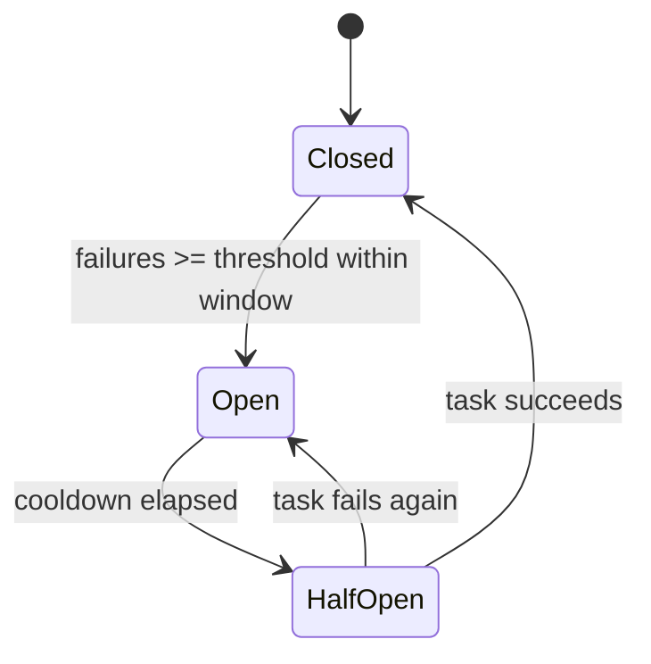

# Circuit Breakers

Circuit breakers prevent cascading failures by temporarily stopping task execution when a task fails repeatedly. This is especially useful for tasks that call external APIs or services.

## How It Works

A circuit breaker tracks failures within a time window and transitions through three states:



- **Closed** — Normal operation. Tasks execute as usual. Failures are counted.
- **Open** — Too many failures. Tasks are immediately rejected without execution.
- **Half-Open** — After the cooldown period, one task is allowed through as a test. If it succeeds, the breaker closes. If it fails, the breaker reopens.

## Configuration

Enable circuit breakers per task using the `circuit_breaker` parameter:

```python
@queue.task(
    circuit_breaker={
        "threshold": 5,    # Open after 5 failures
        "window": 60,      # Within a 60-second window
        "cooldown": 300,   # Stay open for 5 minutes before half-open
    }
)
def call_external_api(endpoint: str) -> dict:
    return requests.get(endpoint).json()
```

| Parameter | Type | Default | Description |
|-----------|------|---------|-------------|
| `threshold` | `int` | `5` | Number of failures to trigger the breaker |
| `window` | `int` | `60` | Time window in seconds for counting failures |
| `cooldown` | `int` | `300` | Seconds to wait before allowing a test request |

## Inspecting Circuit Breaker State

### Python API

```python
breakers = queue.circuit_breakers()
for cb in breakers:
    print(f"{cb['task_name']}: {cb['state']} (failures: {cb['failure_count']})")
```

### Dashboard API

```bash
curl http://localhost:8080/api/circuit-breakers
```

```json
[
    {
        "task_name": "myapp.tasks.call_external_api",
        "state": "open",
        "failure_count": 5,
        "last_failure": 1700000010000,
        "cooldown_until": 1700000310000
    }
]
```

## When to Use

Circuit breakers are most useful for tasks that interact with external systems:

- **External API calls** — prevent hammering a down service
- **Database connections** — stop retrying when the database is unreachable
- **Third-party services** — email providers, payment gateways, etc.

For purely internal computation tasks, circuit breakers are usually unnecessary — standard retries with backoff are sufficient.

## Combining with Retries

Circuit breakers and retries work together. A task with both will:

1. Retry on failure up to `max_retries` times (with backoff)
2. Count each final failure toward the circuit breaker threshold
3. Once the breaker opens, new jobs for that task are rejected immediately

```python
@queue.task(
    max_retries=3,
    retry_backoff=2.0,
    circuit_breaker={"threshold": 5, "window": 120, "cooldown": 600},
)
def send_email(to: str, subject: str, body: str):
    smtp.send(to, subject, body)
```

## Examples

### External Payment API

```python
@queue.task(
    max_retries=3,
    circuit_breaker={"threshold": 3, "window": 60, "cooldown": 120},
)
def charge_customer(customer_id: str, amount: float):
    response = requests.post(
        "https://api.payment-provider.com/charge",
        json={"customer": customer_id, "amount": amount},
        timeout=10,
    )
    response.raise_for_status()
    return response.json()
```

If the payment API goes down, the circuit breaker opens after 3 failures within 60 seconds, preventing a flood of requests to the failing service. After 2 minutes, a single test request is allowed through.

### Health Check with Monitoring

```python
from taskito.events import EventType

# Log when circuit breakers change state
def monitor_breakers(event_type: EventType, payload: dict):
    breakers = queue.circuit_breakers()
    open_breakers = [b for b in breakers if b["state"] == "open"]
    if open_breakers:
        names = ", ".join(b["task_name"] for b in open_breakers)
        print(f"WARNING: Open circuit breakers: {names}")

queue.on_event(EventType.JOB_FAILED, monitor_breakers)
```
