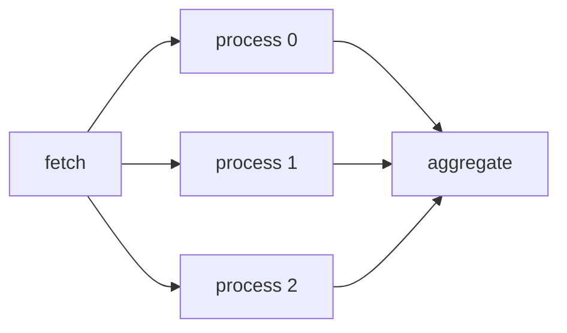

# Workflows

taskito supports two workflow models: **canvas primitives** (chain, group, chord) for simple pipelines, and **DAG workflows** for complex multi-step pipelines with fan-out, conditions, approval gates, and more.

## DAG Workflows

Define multi-step pipelines as directed acyclic graphs. Each step is a registered task; the engine handles ordering, parallelism, failure propagation, and state tracking.

```python
from taskito.workflows import Workflow

@queue.task()
def extract(): return fetch_data()

@queue.task()
def transform(data): return clean(data)

@queue.task()
def load(data): db.insert(data)

wf = Workflow(name="etl")
wf.step("extract", extract)
wf.step("transform", transform, after="extract")
wf.step("load", load, after="transform")

run = queue.submit_workflow(wf)
result = run.wait(timeout=60)
print(result.state)  # WorkflowState.COMPLETED
```

### Step Configuration

Each step accepts the same options as `queue.enqueue()`:

| Parameter | Type | Default | Description |
|-----------|------|---------|-------------|
| `name` | `str` | required | Unique step name |
| `task` | `TaskWrapper` | required | Registered task function |
| `after` | `str \| list[str]` | `None` | Predecessor step(s) |
| `args` | `tuple` | `()` | Positional arguments |
| `kwargs` | `dict` | `None` | Keyword arguments |
| `queue` | `str` | `None` | Override queue name |
| `max_retries` | `int` | `None` | Override retry count |
| `timeout_ms` | `int` | `None` | Override timeout |
| `priority` | `int` | `None` | Override priority |
| `fan_out` | `str` | `None` | Fan-out strategy (`"each"`) |
| `fan_in` | `str` | `None` | Fan-in strategy (`"all"`) |
| `condition` | `str \| callable` | `None` | Execution condition |

### Workflow Decorator

Register reusable workflow factories:

```python
@queue.workflow("nightly_etl")
def etl_pipeline():
    wf = Workflow()
    wf.step("extract", extract)
    wf.step("load", load, after="extract")
    return wf

run = etl_pipeline.submit()
run.wait()
```

## Fan-Out / Fan-In

Split a step's result into parallel child jobs, then collect results:



```python
@queue.task()
def fetch() -> list[int]:
    return [10, 20, 30]

@queue.task()
def process(item: int) -> int:
    return item * 2

@queue.task()
def aggregate(results: list[int]) -> int:
    return sum(results)

wf = Workflow(name="map_reduce")
wf.step("fetch", fetch)
wf.step("process", process, after="fetch", fan_out="each")
wf.step("aggregate", aggregate, after="process", fan_in="all")

run = queue.submit_workflow(wf)
result = run.wait(timeout=30)
# aggregate receives [20, 40, 60]
```

The `fan_out="each"` strategy calls the task once per element in the predecessor's return value. Results are collected in order by `fan_in="all"`.

## Conditions

Control which steps execute based on predecessor outcomes:

```python
wf = Workflow(name="deploy_pipeline")
wf.step("test", run_tests)
wf.step("deploy", deploy, after="test")  # default: on_success
wf.step("rollback", rollback, after="deploy", condition="on_failure")
wf.step("notify", send_slack, after="deploy", condition="always")
```

| Condition | Runs when |
|-----------|-----------|
| `None` / `"on_success"` | All predecessors completed successfully |
| `"on_failure"` | Any predecessor failed |
| `"always"` | Predecessors are terminal (regardless of outcome) |
| `callable` | `condition(ctx)` returns `True` |

### Callable Conditions

Pass a function that receives a `WorkflowContext`:

```python
from taskito.workflows import WorkflowContext

def high_score(ctx: WorkflowContext) -> bool:
    return ctx.results["validate"]["score"] > 0.95

wf.step("deploy", deploy, after="validate", condition=high_score)
```

`WorkflowContext` provides: `results` (predecessor return values), `statuses`, `failure_count`, `success_count`, `run_id`.

## Error Handling

Control failure behavior at the workflow level:

=== "Fail Fast (default)"

    ```python
    wf = Workflow(name="strict", on_failure="fail_fast")
    ```

    One failure cancels all pending steps. The workflow transitions to `FAILED`.

=== "Continue"

    ```python
    wf = Workflow(name="resilient", on_failure="continue")
    ```

    Failed steps skip their `on_success` dependents, but independent branches keep running. Steps with `condition="on_failure"` or `"always"` still execute.

## Approval Gates

Pause a workflow for human review:

```python
wf = Workflow(name="ml_deploy")
wf.step("train", train_model)
wf.step("evaluate", evaluate, after="train")
wf.gate("approve", after="evaluate", timeout=86400, on_timeout="reject")
wf.step("deploy", deploy, after="approve")
```

The gate enters `WAITING_APPROVAL` status. Resolve it programmatically:

```python
run = queue.submit_workflow(wf)

# Later, after review:
queue.approve_gate(run.id, "approve")  # workflow continues
# or:
queue.reject_gate(run.id, "approve")   # gate fails, downstream skipped
```

| Parameter | Type | Default | Description |
|-----------|------|---------|-------------|
| `timeout` | `float` | `None` | Seconds until auto-resolve |
| `on_timeout` | `str` | `"reject"` | `"approve"` or `"reject"` |
| `message` | `str` | `None` | Human-readable approval message |

## Sub-Workflows

Nest workflows for composition:

```python
@queue.workflow("etl")
def etl_pipeline(region):
    wf = Workflow()
    wf.step("extract", extract, args=[region])
    wf.step("load", load, after="extract")
    return wf

@queue.workflow("daily")
def daily_pipeline():
    wf = Workflow()
    wf.step("eu_etl", etl_pipeline.as_step(region="eu"))
    wf.step("us_etl", etl_pipeline.as_step(region="us"))
    wf.step("reconcile", reconcile, after=["eu_etl", "us_etl"])
    return wf

run = daily_pipeline.submit()
```

Child workflows run independently with their own nodes and state. Cancelling the parent cascades to children.

## Cron-Scheduled Workflows

Combine `@queue.periodic()` with `@queue.workflow()`:

```python
@queue.periodic(cron="0 0 2 * * *")
@queue.workflow("nightly_analytics")
def nightly():
    wf = Workflow()
    wf.step("extract", extract_clickstream)
    wf.step("aggregate", build_dashboards, after="extract")
    return wf
```

Each cron trigger submits a new workflow run.

## Incremental Runs

Skip unchanged steps by reusing results from a prior run:

```python
run1 = queue.submit_workflow(wf)
run1.wait()

# Second run: only re-execute dirty nodes
run2 = queue.submit_workflow(wf, incremental=True, base_run=run1.id)
run2.wait()
```

Nodes that completed in the base run get `CACHE_HIT` status. If any predecessor is dirty (failed or missing in the base run), downstream nodes re-execute.

Set a TTL to expire cached results:

```python
wf = Workflow(name="pipeline", cache_ttl=3600)  # 1 hour
```

## Monitoring

### Status

```python
run = queue.submit_workflow(wf)
status = run.status()
print(status.state)          # WorkflowState.RUNNING
print(status.nodes["step_a"])  # NodeSnapshot(status=COMPLETED, ...)
```

### Wait

```python
final = run.wait(timeout=60)
if final.state == WorkflowState.COMPLETED:
    print("All steps succeeded")
```

### Cancel

```python
run.cancel()  # Skips pending steps, cancels running jobs
```

## Visualization

Render the workflow DAG as a diagram:

```python
# Pre-execution (structure only)
print(wf.visualize("mermaid"))

# Live status (with node colors)
print(run.visualize("mermaid"))
print(run.visualize("dot"))  # Graphviz DOT format
```

## Graph Analysis

Analyze the workflow DAG before execution:

```python
wf.ancestors("load")       # ["extract", "transform"]
wf.descendants("extract")  # ["transform", "load"]
wf.topological_levels()    # [["extract"], ["transform"], ["load"]]
wf.stats()                 # {nodes: 3, edges: 2, depth: 3, ...}

# With cost estimates
path, cost = wf.critical_path({"extract": 2.0, "transform": 7.0, "load": 1.0})
# path=["extract", "transform", "load"], cost=10.0

plan = wf.execution_plan(max_workers=4)
# [["extract"], ["transform"], ["load"]]

analysis = wf.bottleneck_analysis({"extract": 2.0, "transform": 7.0, "load": 1.0})
# {"node": "transform", "percentage": 70.0, ...}
```

## Node Statuses

| Status | Meaning |
|--------|---------|
| `PENDING` | Waiting for predecessors or job creation |
| `RUNNING` | Job is executing |
| `COMPLETED` | Step succeeded |
| `FAILED` | Step failed (after retries exhausted) |
| `SKIPPED` | Skipped due to failure cascade or condition |
| `WAITING_APPROVAL` | Gate awaiting approve/reject |
| `CACHE_HIT` | Reused result from a prior run |

---

## Canvas Primitives

For simpler pipelines without DAG features, taskito also provides **chain**, **group**, and **chord**.

### Signatures

A `Signature` wraps a task call for deferred execution:

```python
from taskito import chain, group, chord

sig = add.s(1, 2)    # Mutable — receives previous result
sig = add.si(1, 2)   # Immutable — ignores previous result
```

### Chain

Execute tasks sequentially, piping results:

```python
result = chain(
    extract.s("https://api.example.com/users"),
    transform.s(),
    load.s(),
).apply(queue)
```

### Group

Execute tasks in parallel:

```python
jobs = group(
    process.s(1),
    process.s(2),
    process.s(3),
).apply(queue)
```

### Chord

Fan-out with a callback:

```python
result = chord(
    group(fetch.s(url) for url in urls),
    merge.s(),
).apply(queue)
```

### chunks / starmap

```python
from taskito import chunks, starmap

# Batch processing
results = chunks(process_batch, items, chunk_size=100).apply(queue)

# Tuple unpacking
results = starmap(add, [(1, 2), (3, 4)]).apply(queue)
```
