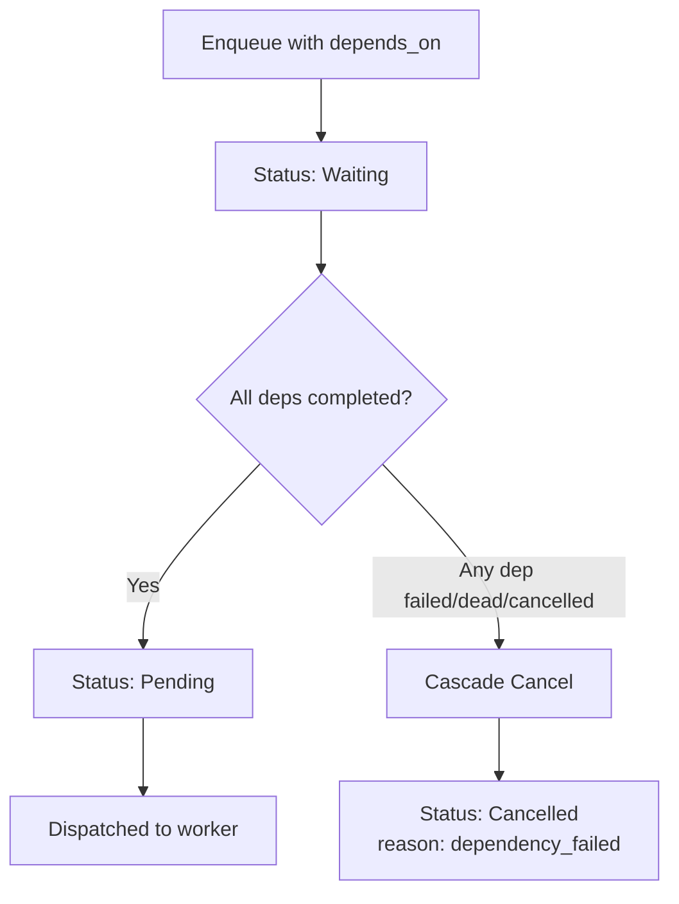
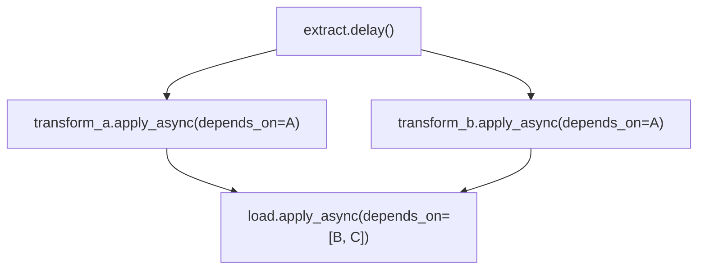

# Task Dependencies

quickq supports declaring dependencies between jobs, allowing you to build DAG-style workflows where a job only runs after its upstream dependencies have completed successfully.

## Basic Usage

Pass `depends_on` when enqueuing a job to declare that it should wait for one or more other jobs to finish:

=== "Single dependency"

    ```python
    job_a = extract.delay(url)

    # job_b won't start until job_a completes successfully
    job_b = transform.apply_async(
        args=(job_a.id,),
        depends_on=job_a.id,
    )
    ```

=== "Multiple dependencies"

    ```python
    job_a = fetch.delay("https://api1.example.com")
    job_b = fetch.delay("https://api2.example.com")

    # job_c waits for both job_a and job_b
    job_c = merge.apply_async(
        args=(),
        depends_on=[job_a.id, job_b.id],
    )
    ```

The `depends_on` parameter accepts:

| Value | Description |
|---|---|
| `str` | A single job ID |
| `list[str]` | Multiple job IDs (all must complete) |
| `None` (default) | No dependencies |

!!! tip
    You can also use `depends_on` with `queue.enqueue()` directly:

    ```python
    job_id = queue.enqueue(
        task_name="myapp.tasks.merge",
        args=(),
        depends_on=[job_a.id, job_b.id],
    )
    ```

## How It Works

1. When a job with `depends_on` is enqueued, it enters a **waiting** state
2. The scheduler periodically checks waiting jobs to see if all dependencies have completed
3. Once every dependency has `status=completed`, the job transitions to `pending` and becomes eligible for dispatch
4. If any dependency fails, dies, or is cancelled, the dependent job is **cascade cancelled**



## Cascade Cancel

When a dependency fails (exhausts retries and moves to DLQ), dies, or is cancelled, all downstream dependents are automatically cancelled. This propagates transitively through the entire dependency graph:

```python
job_a = step_one.delay()
job_b = step_two.apply_async(args=(), depends_on=job_a.id)
job_c = step_three.apply_async(args=(), depends_on=job_b.id)

# If job_a fails permanently:
#   - job_b is cascade cancelled
#   - job_c is cascade cancelled (transitive)
```

!!! warning "Cascade is immediate"
    As soon as a dependency enters a terminal failure state (`dead` or `cancelled`), all downstream dependents are cancelled in the same scheduler tick. There is no grace period.

## Inspecting Dependencies

### `job.dependencies`

Returns the list of job IDs this job depends on:

```python
job_c = merge.apply_async(
    args=(),
    depends_on=[job_a.id, job_b.id],
)

fetched = queue.get_job(job_c.id)
print(fetched.dependencies)  # ['01H5K6X...', '01H5K7Y...']
```

### `job.dependents`

Returns the list of job IDs that depend on this job:

```python
fetched_a = queue.get_job(job_a.id)
print(fetched_a.dependents)  # ['01H5K8Z...']  (job_c's ID)
```

## Error Handling

### Missing Dependencies

If you reference a job ID that does not exist, enqueue raises a `ValueError`:

```python
try:
    job = transform.apply_async(
        args=(),
        depends_on="nonexistent-job-id",
    )
except ValueError as e:
    print(e)  # "Dependency job 'nonexistent-job-id' not found"
```

### Already-Dead Dependencies

If a dependency is already in a terminal failure state (`dead` or `cancelled`) at enqueue time, the dependent job is immediately cancelled:

```python
dead_job = queue.get_job(some_dead_id)
assert dead_job.status == "dead"

# This job is immediately cancelled — it will never run
job = transform.apply_async(
    args=(),
    depends_on=dead_job.id,
)

fetched = queue.get_job(job.id)
print(fetched.status)  # "cancelled"
```

## DAG Workflow Examples

### Diamond Pattern

A classic diamond dependency graph where two branches converge:



```python
# Extract
job_a = extract.delay(source_url)

# Two parallel transforms, each depending on extract
job_b = transform_a.apply_async(
    args=("schema_a",),
    depends_on=job_a.id,
)
job_c = transform_b.apply_async(
    args=("schema_b",),
    depends_on=job_a.id,
)

# Load waits for both transforms
job_d = load.apply_async(
    args=(),
    depends_on=[job_b.id, job_c.id],
)
```

### Multi-Stage Pipeline

A sequential pipeline with fan-out at one stage:

```python
# Stage 1: Download
download_jobs = [
    download.delay(url) for url in urls
]

# Stage 2: Process each download (each depends on its own download)
process_jobs = [
    process.apply_async(
        args=(url,),
        depends_on=dl.id,
    )
    for dl, url in zip(download_jobs, urls)
]

# Stage 3: Aggregate all results
aggregate_job = aggregate.apply_async(
    args=(),
    depends_on=[j.id for j in process_jobs],
)
```

### Conditional Branching

Combine dependencies with metadata to build conditional workflows:

```python
job_a = validate.delay(data)

# Both branches depend on validation
job_success = on_valid.apply_async(
    args=(data,),
    depends_on=job_a.id,
    metadata='{"branch": "success"}',
)

# Use a separate task to handle the "validation failed" path
# by inspecting job_a's result in the task body
```

!!! note "Dependencies vs. Workflows"
    `depends_on` is a lower-level primitive than [chains, groups, and chords](workflows.md). Use `depends_on` when you need fine-grained control over a custom DAG. Use the workflow primitives when your pipeline fits a standard pattern.

## Combining with Other Features

Dependencies compose naturally with other quickq features:

```python
job = transform.apply_async(
    args=(data,),
    depends_on=job_a.id,
    priority=10,           # High priority once unblocked
    queue="processing",    # Target queue
    max_retries=5,         # Retry policy
    delay=60,              # Additional delay after deps resolve
    unique_key="transform-daily",  # Deduplication
)
```

!!! info "Delay + depends_on"
    When both `delay` and `depends_on` are set, the job first waits for all dependencies to complete, then waits for the additional delay before becoming eligible for dispatch.
