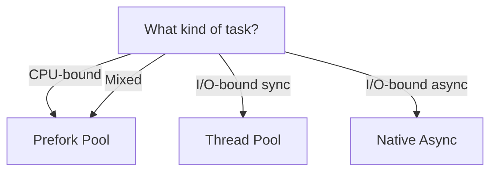

# Execution Models

Choose how tasks execute: OS threads (default), child processes (prefork), or native async.

## Decision Tree



## Comparison

| Mode | Concurrency | GIL | Memory per worker | Startup cost | Best for |
|------|------------|-----|-------------------|--------------|----------|
| **Thread Pool** | `workers` OS threads | Shared | ~1 MB | None | I/O-bound sync tasks |
| **Prefork** | `workers` child processes | Independent | ~30 MB | One app import per child | CPU-bound tasks, mixed workloads |
| **Native Async** | `async_concurrency` coroutines | Shared (event loop) | Negligible per coroutine | None | I/O-bound async tasks |

## Thread Pool (default)

The default. Runs sync task functions on Rust `std::thread` threads. Each worker acquires the Python GIL only during task execution — the scheduler and dispatch logic never touch it.

```python
# Default — thread pool with auto-detected worker count
queue.run_worker()

# Explicit worker count
queue.run_worker(workers=8)
```

```bash
taskito worker --app myapp:queue --workers 8
```

Because threads share a single GIL, CPU-bound tasks block each other. For Python code that spends most of its time in C extensions (numpy, pandas) that release the GIL, threads still work well.

## Prefork Pool

Spawns separate child processes. Each process has its own Python interpreter and GIL, so CPU-bound tasks run in true parallel.

```python
queue.run_worker(pool="prefork", app="myapp:queue")
```

```bash
taskito worker --app myapp:queue --pool prefork
```

The `app` parameter tells each child process where to import your `Queue` instance. It must be a module-level name (`"module:attribute"` format) — tasks defined inside functions or closures cannot be imported by child processes.

For more details, see the [Prefork Pool guide](prefork.md).

## Native Async

`async def` task functions run on a dedicated Python event loop thread. No `asyncio.run()` wrapping, no thread-per-task overhead.

```python
@queue.task()
async def fetch_prices(symbol: str) -> dict:
    async with httpx.AsyncClient() as client:
        r = await client.get(f"https://api.example.com/prices/{symbol}")
        return r.json()
```

Control how many coroutines run at once:

```python
queue = Queue(
    db_path="myapp.db",
    async_concurrency=200,  # default: 100
)
```

For more details, see the [Native Async Tasks guide](async-tasks.md).

## Mixing Sync and Async

A single queue handles both sync and async tasks. No configuration needed — the worker inspects each task at registration time and routes it to the correct pool.

```python
@queue.task()
def resize_image(path: str) -> str:
    # Sync — runs on thread pool
    ...

@queue.task()
async def send_notification(user_id: str) -> None:
    # Async — runs on event loop
    ...
```

Both are enqueued, retried, rate-limited, and monitored identically.

## workers vs async_concurrency

These two parameters are independent:

```python
queue = Queue(
    workers=4,              # OS threads (or child processes) for sync tasks
    async_concurrency=200,  # concurrent coroutines for async tasks
)
```

`workers=4` means 4 sync tasks can execute at the same time. `async_concurrency=200` means 200 async tasks can be in-flight concurrently on the event loop. A queue with both set runs up to `4 + 200` tasks simultaneously.

!!! tip
    For mostly-async workloads, keep `workers` small (2–4) and raise `async_concurrency`. For mostly-sync I/O workloads, raise `workers`. For CPU-bound workloads, switch to prefork.
