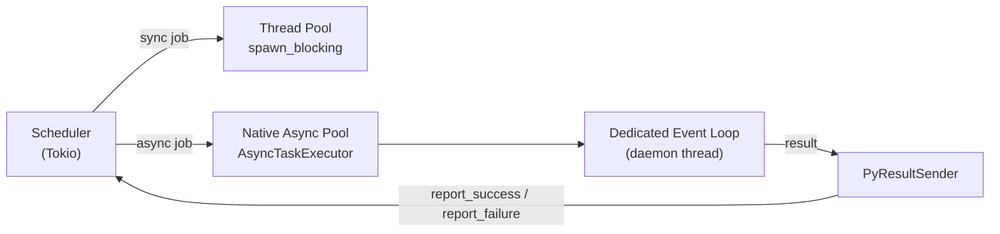

# Native Async Tasks

taskito runs async task functions natively — no wrapping in `asyncio.run()`, no thread-pool bridging. Define a coroutine and the worker dispatches it directly onto a dedicated event loop.

```python
from taskito import Queue

queue = Queue(db_path="myapp.db")

@queue.task()
async def fetch_data(url: str) -> dict:
    import httpx
    async with httpx.AsyncClient() as client:
        response = await client.get(url)
        return response.json()
```

Enqueue it the same way as a sync task:

```python
job = fetch_data.delay("https://api.example.com/data")
result = job.result(timeout=30)
```

## How It Works

When a task decorated with `@queue.task()` is an `async def`, taskito marks it for native dispatch. At worker startup, a `NativeAsyncPool` is initialized alongside the standard thread pool. When the scheduler dequeues an async job it routes it to the native pool instead of a sync worker thread.



The dedicated event loop lives in its own Python daemon thread. All async tasks for a single worker share that loop; a semaphore caps simultaneous execution.

## Concurrency Limit

Control how many async tasks run concurrently on the event loop:

```python
queue = Queue(
    db_path="myapp.db",
    async_concurrency=50,   # default: 100
)
```

This is independent of the `workers` parameter (sync thread count). A typical mixed setup might be:

```python
queue = Queue(
    db_path="myapp.db",
    workers=4,              # 4 OS threads for sync tasks
    async_concurrency=200,  # up to 200 concurrent async tasks
)
```

## Job Context

`current_job` works inside async tasks — it reads from `contextvars` rather than `threading.local`, so it's safe across `await` boundaries:

```python
from taskito.context import current_job

@queue.task()
async def process(item_id: str) -> str:
    current_job.log(f"Starting {item_id}")
    await asyncio.sleep(1)
    current_job.update_progress(50)
    await asyncio.sleep(1)
    current_job.update_progress(100)
    return f"done:{item_id}"
```

Each async task gets an isolated `ContextVar` token. Concurrent tasks on the same loop do not see each other's contexts.

## Resource Injection

Async tasks support `inject=` and `Inject["name"]` annotations the same way as sync tasks:

```python
@queue.worker_resource("http_client")
def make_http_client():
    import httpx
    return httpx.AsyncClient()

@queue.task(inject=["http_client"])
async def fetch(url: str, http_client=None) -> dict:
    response = await http_client.get(url)
    return response.json()
```

!!! note
    Resource initialization still runs on worker startup in the main thread. The resource instance is then passed into the async task at dispatch time.

## Middleware

Middleware `before()` and `after()` hooks run for async tasks the same as for sync tasks. They are called from within the async execution context, so `current_job` is available:

```python
class LoggingMiddleware(TaskMiddleware):
    def before(self, ctx):
        current_job.log("task started")

    def after(self, ctx, result, error):
        current_job.log("task finished")
```

## Retry Filtering

`retry_on` and `dont_retry_on` on `@queue.task()` apply to async tasks:

```python
@queue.task(
    max_retries=5,
    retry_on=[httpx.TimeoutException],
    dont_retry_on=[httpx.HTTPStatusError],
)
async def fetch_with_retry(url: str) -> dict:
    ...
```

## Mixing Sync and Async Tasks

A single queue handles both sync and async tasks transparently. The worker dispatches each job to the correct pool based on the `_taskito_is_async` attribute set at registration time:

```python
@queue.task()
def sync_task(x: int) -> int:
    return x * 2

@queue.task()
async def async_task(x: int) -> int:
    await asyncio.sleep(0.1)
    return x * 2
```

Both are enqueued, retried, rate-limited, and monitored identically.

## Feature Flag

The native async dispatch path is compiled into the `taskito-async` Rust crate and enabled via the `native-async` feature flag. Pre-built wheels on PyPI include it by default. If you build from source:

```bash
maturin develop --features native-async
```

Without the feature, async tasks are still enqueued and processed — they fall back to running via `asyncio.run()` on a worker thread.

## Async Queue Methods

All inspection methods have async variants that run in a thread pool:

```python
# Sync
stats = queue.stats()
dead = queue.dead_letters()
new_id = queue.retry_dead(dead_id)
cancelled = queue.cancel_job(job_id)
result = job.result(timeout=30)

# Async equivalents
stats = await queue.astats()
dead = await queue.adead_letters()
new_id = await queue.aretry_dead(dead_id)
cancelled = await queue.acancel_job(job_id)
result = await job.aresult(timeout=30)
```

### Async Worker

```python
async def main():
    await queue.arun_worker(queues=["default"])

asyncio.run(main())
```
