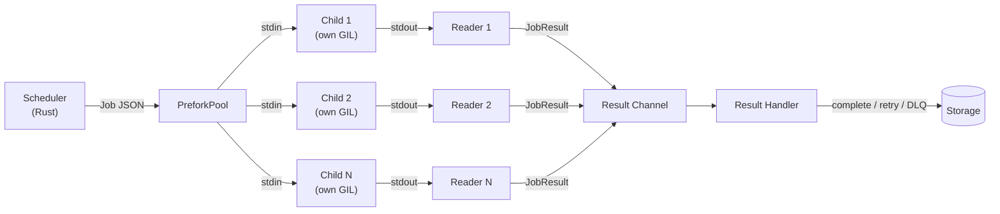

# Prefork Worker Pool

Spawn separate child processes for true CPU parallelism. Each child has its own Python GIL, so CPU-bound tasks don't block each other.

## When to Use

| Workload | Recommended pool | Why |
|----------|-----------------|-----|
| I/O-bound (HTTP calls, DB queries) | `thread` (default) | Threads release the GIL during I/O |
| CPU-bound (data processing, ML) | `prefork` | Each process owns its GIL |
| Mixed workloads | `prefork` | CPU tasks benefit; I/O tasks work fine too |

## Getting Started

```python
queue = Queue(db_path="myapp.db", workers=4)
queue.run_worker(pool="prefork", app="myapp:queue")
```

```bash
taskito worker --app myapp:queue --pool prefork
```

The `app` parameter tells each child process how to import your Queue instance. It must be an importable path in `module:attribute` format.

## How It Works



1. The Rust scheduler dequeues jobs from storage
2. `PreforkPool` serializes each job as JSON and writes it to the least-loaded child's stdin pipe
3. Each child deserializes the job, executes the task wrapper (with middleware, resources, proxies), and writes the result as JSON to stdout
4. Reader threads parse results and feed them back to the scheduler
5. The scheduler updates job status in storage

## Configuration

| Parameter | Type | Default | Description |
|-----------|------|---------|-------------|
| `pool` | `str` | `"thread"` | Set to `"prefork"` to enable |
| `app` | `str` | — | Import path to Queue instance (required) |
| `workers` | `int` | CPU count | Number of child processes |

## Migrating from Thread Pool

The thread pool is the default. To switch to prefork:

=== "Before (thread pool)"

    ```python
    queue.run_worker()
    ```

=== "After (prefork)"

    ```python
    queue.run_worker(pool="prefork", app="myapp:queue")
    ```

Everything else stays the same — task decorators, middleware, resources, events, and the scheduler all work identically. The only difference is where task code executes (child process vs. worker thread).

## Debugging Child Processes

Children inherit the parent's stderr, so `print()` statements and Python logging appear in the parent's terminal.

Enable debug logging to see child lifecycle events:

```python
import logging
logging.getLogger("taskito.prefork.child").setLevel(logging.DEBUG)
```

Log output includes:
- `child ready (app=..., pid=...)` — child initialized and waiting for jobs
- `executing task_name[job_id]` — job received (DEBUG level)
- `task task_name[job_id] failed: ...` — task error
- `shutdown received` — clean shutdown
- `resource teardown error` — resource cleanup failure

## Limitations

- **Tasks must be importable**: Each child process imports the app module independently. Tasks defined inside functions or closures cannot be imported.
- **No shared state**: Children are separate processes. In-memory caches, globals, or module-level state are not shared between children.
- **Startup cost**: Each child imports the full app module on start. This happens once per child, not per job.
- **Resource re-initialization**: Worker resources (DB connections, etc.) are initialized independently in each child.
