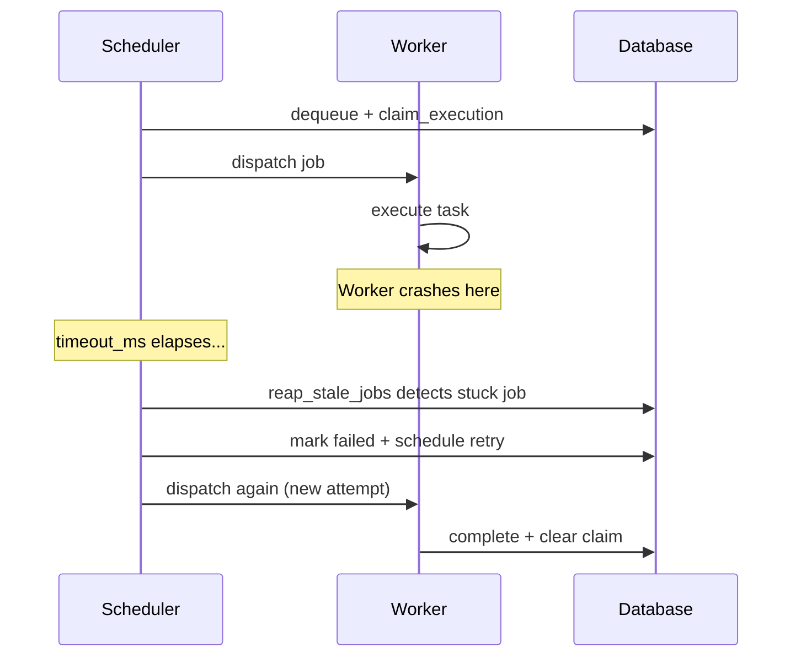

# Delivery Guarantees

Taskito provides **at-least-once delivery**. Every enqueued job will be executed at least once, but may be executed more than once if a worker crashes mid-execution.

## What This Means

- A job **will not be lost** — if a worker dies, the scheduler detects the stale job and retries it
- A job **may run twice** — if a worker crashes after starting but before marking the job complete
- A job **will not run concurrently** — `claim_execution` prevents two workers from picking up the same job

## Why Not Exactly-Once?

Exactly-once delivery is [impossible in distributed systems](https://bravenewgeek.com/you-cannot-have-exactly-once-delivery/) without two-phase commit. Taskito's approach matches Celery, SQS, and most production job systems: deliver at least once, design tasks to handle duplicates.

## How Recovery Works



The `claim_execution` mechanism prevents two workers from executing the same job simultaneously. But it cannot prevent re-execution after a crash — the claim is cleared when the stale reaper detects the timeout.

## Writing Idempotent Tasks

Since tasks may run more than once, design them to be safe on re-execution:

### Use database upserts

```python
@queue.task()
def create_user(email, name):
    # UPSERT — safe to run twice
    db.execute(
        "INSERT INTO users (email, name) VALUES (?, ?) "
        "ON CONFLICT (email) DO UPDATE SET name = ?",
        (email, name, name),
    )
```

### Use idempotency keys

```python
@queue.task()
def charge_customer(order_id, amount):
    # Check if already charged
    if db.execute("SELECT 1 FROM charges WHERE order_id = ?", (order_id,)).fetchone():
        return  # Already processed

    payment_provider.charge(amount, idempotency_key=f"order-{order_id}")
    db.execute("INSERT INTO charges (order_id, amount) VALUES (?, ?)", (order_id, amount))
```

### Use unique tasks for deduplication

```python
# Only one pending/running instance per key
job = send_report.apply_async(
    args=(user_id,),
    unique_key=f"report-{user_id}",
)
```

If a job with the same `unique_key` is already pending or running, the duplicate is silently dropped. See [Advanced > Unique Tasks](advanced.md) for details.

### Avoid side effects that can't be undone

```python
# Bad — sends duplicate emails on retry
@queue.task()
def notify(user_id):
    send_email(user_id, "Your order shipped")

# Good — check before sending
@queue.task()
def notify(user_id):
    if not db.execute("SELECT notified FROM orders WHERE user_id = ?", (user_id,)).fetchone()[0]:
        send_email(user_id, "Your order shipped")
        db.execute("UPDATE orders SET notified = 1 WHERE user_id = ?", (user_id,))
```

## Summary

| Guarantee | Taskito | Celery | SQS |
|-----------|---------|--------|-----|
| Delivery | At-least-once | At-least-once | At-least-once |
| Duplicate prevention | `claim_execution` (dispatch-level) | Visibility timeout | Visibility timeout |
| Deduplication | `unique_key` (enqueue-level) | Manual | Message dedup ID |
| Crash recovery | Stale reaper (timeout-based) | Worker ack timeout | Visibility timeout |
