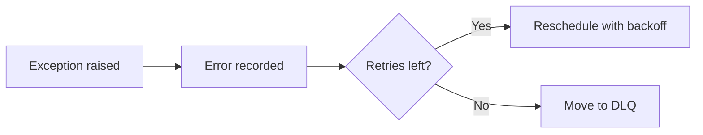

# Error Handling & Troubleshooting

This guide covers how to debug task failures, inspect error history, handle common problems, and understand what happens when things go wrong.

## Task Failure Lifecycle

When a task raises an exception:

1. The error message is recorded in the `job_errors` table
2. If `retry_count < max_retries`, the job is rescheduled with exponential backoff
3. If all retries are exhausted, the job moves to the **dead letter queue** (status: `dead`)



## Inspecting Error History

Every failed attempt is recorded. Use `job.errors` to see the full history:

```python
job = unreliable_task.delay()

# After the job fails and retries...
for error in job.errors:
    print(f"Attempt {error['attempt']}: {error['error']} at {error['failed_at']}")
```

Each error entry:

| Field | Type | Description |
|---|---|---|
| `id` | `str` | Unique error record ID |
| `job_id` | `str` | The job this error belongs to |
| `attempt` | `int` | Attempt number (0-indexed) |
| `error` | `str` | Error message string |
| `failed_at` | `int` | Timestamp in milliseconds |

## Diagnosing Dead Letters

When a job exhausts all retries, it lands in the DLQ. Inspect dead letters to understand what went wrong:

```python
dead = queue.dead_letters(limit=20)

for d in dead:
    print(f"Task:    {d['task_name']}")
    print(f"Error:   {d['error']}")
    print(f"Retries: {d['retry_count']}")
    print(f"Queue:   {d['queue']}")
    print()
```

### Common Patterns

**Same error on every attempt** — The failure is deterministic (e.g., bad arguments, missing dependency). Fix the root cause, then replay:

```python
new_job_id = queue.retry_dead(dead[0]["id"])
```

**Intermittent errors** — The failure is transient (e.g., network timeout). Replaying will likely succeed:

```python
# Replay all dead letters
for d in dead:
    queue.retry_dead(d["id"])
```

!!! note "Config preservation"
    Replayed jobs preserve the original job's `priority`, `max_retries`, `timeout`, and `result_ttl` settings — no need to re-specify them.

**Error message mentions serialization** — See [Serialization Errors](#serialization-errors) below.

## Common Error Scenarios

### Serialization Errors

taskito uses `cloudpickle` to serialize task arguments and return values. Serialization fails when:

- **Passing unpicklable objects**: Open file handles, database connections, sockets, thread locks
- **Module-level objects that can't be resolved**: Dynamically generated classes without stable import paths
- **Very large objects**: While cloudpickle has no hard limit, extremely large payloads slow down SQLite writes

**Fix**: Pass simple, serializable data (strings, numbers, dicts, lists) as task arguments. Reconstruct complex objects inside the task:

```python
# Bad — passing a connection object
@queue.task()
def query(conn, sql):  # conn can't be pickled
    return conn.execute(sql)

# Good — pass connection info, create inside the task
@queue.task()
def query(db_url, sql):
    conn = create_connection(db_url)
    return conn.execute(sql)
```

### Task Not Found in Registry

```
KeyError: "Task 'myapp.process_data' not found in registry"
```

This means the worker doesn't have the task registered. Causes:

- The module defining the task wasn't imported before starting the worker
- The task name changed (function renamed or moved to a different module)
- The `--app` flag points to the wrong module

**Fix**: Ensure all task modules are imported when your `Queue` instance is created. Typically, define tasks in the same module as the queue, or import them in your app's `__init__.py`.

### SQLite Lock Contention

```
OperationalError: database is locked
```

SQLite allows concurrent reads (WAL mode), but only one writer at a time. taskito sets `busy_timeout=5000ms` to wait for locks, but heavy write loads can still cause contention.

**Causes:**

- Multiple processes writing to the same SQLite file simultaneously
- Very large batch inserts blocking the writer
- Long-running transactions from external tools (e.g., DB browser) holding locks

**Fixes:**

- Avoid opening the database file with other tools while the worker is running
- Use `enqueue_many()` / `task.map()` for batch inserts — they use a single transaction
- If running multiple processes, ensure only one worker process writes at a time

### Timeout Reaping

```
Task timed out after 10s
```

If a task exceeds its `timeout`, the scheduler detects it (every ~5 seconds) and marks it as failed, triggering retry/DLQ logic.

```python
@queue.task(timeout=30)  # 30 second timeout
def long_task():
    ...
```

!!! warning
    Timeout reaping marks the job as failed, but **does not kill the Python thread**. The task function continues running until it finishes — the result is simply discarded. For CPU-bound tasks that might hang, consider adding your own internal timeout logic.

### Soft Timeouts

While hard timeouts (above) are enforced by the scheduler, **soft timeouts** let the task itself react to time pressure:

```python
from taskito import current_job

@queue.task(soft_timeout=30)
def long_task():
    for chunk in data_chunks:
        process(chunk)
        current_job.check_timeout()  # raises SoftTimeoutError after 30s
```

| Timeout Type | Mechanism | Exception |
|---|---|---|
| Hard timeout (`timeout`) | Scheduler reaps the job externally | `TaskTimeoutError` (internal) |
| Soft timeout (`soft_timeout`) | Task checks elapsed time via `check_timeout()` | `SoftTimeoutError` |

Soft timeouts are **cooperative** — the task must call `check_timeout()` at safe points.

### Worker Crash Behavior

If the worker process crashes (kill -9, OOM, power loss):

- **Running jobs** stay in `running` status in SQLite
- On the next worker start, the scheduler's **stale job reaper** detects jobs that have been `running` longer than their timeout and marks them as failed
- If no timeout is set, stale jobs with no timeout remain in `running` status until manually cleaned up

**Recommendation**: Always set a `timeout` on tasks so that stale jobs are automatically recovered:

```python
@queue.task(timeout=300)  # 5 minute timeout
def process(data):
    ...
```

## Debugging Tips

### Check Queue Stats

Quick health check:

```python
stats = queue.stats()
print(stats)
# {'pending': 0, 'running': 0, 'completed': 450, 'failed': 2, 'dead': 1, 'cancelled': 0}
```

Or via CLI:

```bash
taskito info --app myapp:queue --watch
```

### Use Hooks for Alerting

Set up failure hooks to get notified immediately:

```python
@queue.on_failure
def on_task_failure(task_name, args, kwargs, error):
    print(f"FAILED: {task_name} — {error}")
    # Send to Slack, PagerDuty, etc.
```

### Test Mode for Isolation

Use [test mode](../operations/testing.md) to run tasks synchronously and inspect errors without a worker:

```python
with queue.test_mode() as results:
    risky_task.delay()

    if results[0].failed:
        print(results[0].error)
        print(results[0].traceback)
```

### Inspect the SQLite Database Directly

For deep debugging, query the SQLite database:

```bash
sqlite3 myapp.db "SELECT id, task_name, status, error FROM jobs WHERE status = 3 LIMIT 10;"
```

Status codes: 0=pending, 1=running, 2=complete, 3=failed, 4=dead, 5=cancelled.

## Error Handling Patterns

### Exception Filtering

Use `retry_on` and `dont_retry_on` to control which exceptions trigger retries:

```python
@queue.task(
    max_retries=5,
    retry_on=[ConnectionError, TimeoutError],
    dont_retry_on=[ValueError],
)
def call_api(url):
    resp = requests.get(url, timeout=10)
    resp.raise_for_status()
    return resp.json()
```

See [Retries — Exception Filtering](retries.md#exception-filtering) for details.

### Cancelling Running Tasks

Cancel a job that is already executing:

```python
# Request cancellation
queue.cancel_running_job(job_id)
```

Inside the task, check for cancellation at safe points:

```python
from taskito import current_job

@queue.task()
def long_task(items):
    for item in items:
        process(item)
        current_job.check_cancelled()  # raises TaskCancelledError
```

`check_cancelled()` raises `TaskCancelledError` if cancellation was requested. Place these checks at natural breakpoints in long-running tasks.

!!! note
    Cancellation is **cooperative** — the task must call `check_cancelled()` to observe it. If the task never checks, it runs to completion.

### Cleanup on Failure

Use try/finally or hooks to clean up resources:

```python
@queue.task()
def process_file(path):
    tmp = download_to_temp(path)
    try:
        return parse(tmp)
    finally:
        os.unlink(tmp)
```

## Exception Hierarchy

taskito defines a hierarchy of exceptions for precise error handling:

```
TaskitoError (base)
├── TaskTimeoutError        — hard timeout exceeded
├── SoftTimeoutError        — soft timeout exceeded (check_timeout)
├── TaskCancelledError      — task cancelled (check_cancelled)
├── MaxRetriesExceededError — all retry attempts exhausted
├── SerializationError      — serialization/deserialization failure
├── CircuitBreakerOpenError — circuit breaker is open
├── RateLimitExceededError  — rate limit exceeded
├── JobNotFoundError        — job ID not found (also a KeyError)
└── QueueError              — queue-level operational error
```

All exceptions inherit from `TaskitoError`, so you can catch the base class for broad handling:

```python
from taskito import TaskitoError, SoftTimeoutError, TaskCancelledError

try:
    result = job.result(timeout=30)
except TaskitoError as e:
    print(f"Taskito error: {e}")
```

Import any exception directly from the `taskito` package:

```python
from taskito import TaskCancelledError, SoftTimeoutError, SerializationError
```
