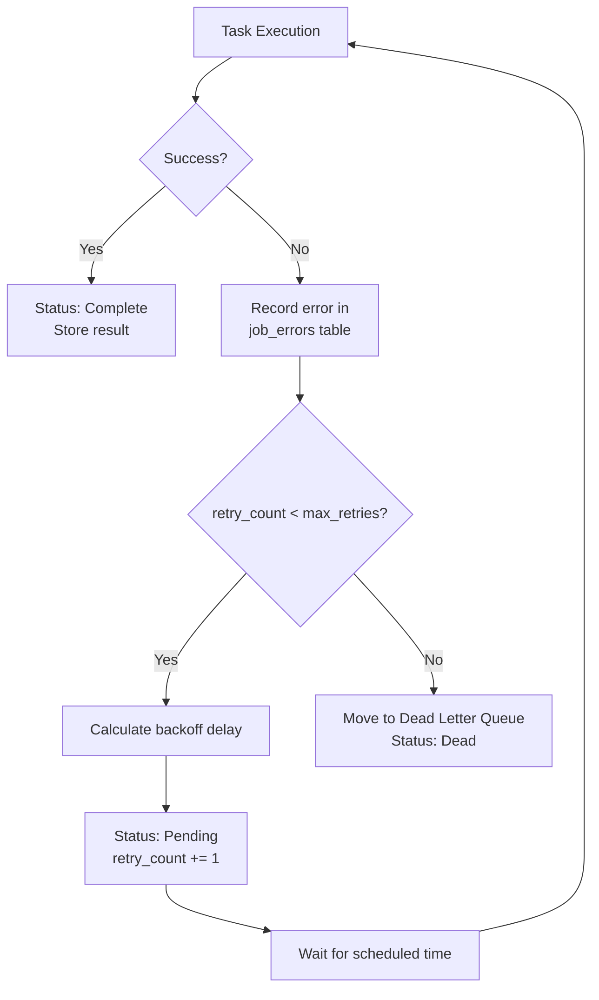

# Retries & Dead Letters

taskito automatically retries failed tasks with exponential backoff and moves permanently failed jobs to a dead letter queue.

## Retry Policy

Configure retries at the task level:

```python
@queue.task(max_retries=5, retry_backoff=2.0)
def flaky_api_call(url):
    response = requests.get(url)
    response.raise_for_status()
    return response.json()
```

| Parameter | Default | Description |
|---|---|---|
| `max_retries` | `3` | Maximum retry attempts before DLQ |
| `retry_backoff` | `1.0` | Base delay in seconds for exponential backoff |

### Backoff Formula

```
delay = min(max_delay, base_delay * 2^retry_count) + jitter
```

- `base_delay` = `retry_backoff` (in seconds)
- `max_delay` = 300 seconds (5 minutes)
- `jitter` = random 0–500ms to prevent thundering herd

**Example with `retry_backoff=2.0`:**

| Attempt | Delay |
|---|---|
| 1st retry | ~2s |
| 2nd retry | ~4s |
| 3rd retry | ~8s |
| 4th retry | ~16s |
| 5th retry | ~32s |

## Retry Flow



## Dead Letter Queue

Jobs that exhaust all retries are moved to the DLQ for inspection and manual replay.

### Inspect Dead Letters

```python
# List the 10 most recent dead letters
dead = queue.dead_letters(limit=10, offset=0)

for d in dead:
    print(f"Job: {d['original_job_id']}")
    print(f"Task: {d['task_name']}")
    print(f"Error: {d['error']}")
    print(f"Retries: {d['retry_count']}")
    print()
```

### Replay Dead Letters

```python
# Re-enqueue a dead letter job (creates a new job)
new_job_id = queue.retry_dead(dead[0]["id"])
```

### Purge Old Dead Letters

```python
# Delete dead letters older than 24 hours
deleted = queue.purge_dead(older_than=86400)
print(f"Purged {deleted} dead letter(s)")
```

## Error History

Every failed attempt is recorded with the error message. Access the full history via `job.errors`:

```python
@queue.task(max_retries=3)
def unreliable():
    raise ConnectionError("timeout")

job = unreliable.delay()

# After the job fails and retries...
for error in job.errors:
    print(f"Attempt {error['attempt']}: {error['error']}")
    # Attempt 0: timeout
    # Attempt 1: timeout
    # Attempt 2: timeout
```

Each error entry contains:

| Field | Type | Description |
|---|---|---|
| `id` | `str` | Unique error record ID |
| `job_id` | `str` | The job this error belongs to |
| `attempt` | `int` | Attempt number (0-indexed) |
| `error` | `str` | Error message |
| `failed_at` | `int` | Timestamp in milliseconds |

## Timeout Reaping

If a task exceeds its `timeout`, the scheduler automatically detects it (checking every ~5 seconds) and treats it as a failure — triggering the retry/DLQ logic.

```python
@queue.task(timeout=10)  # 10 second timeout
def slow_task():
    time.sleep(60)  # Will be reaped after 10s
```
