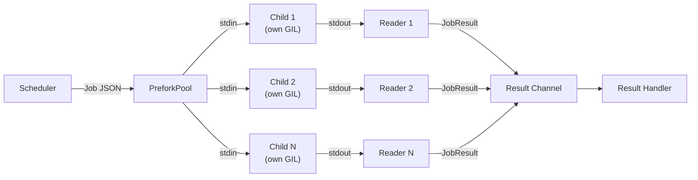
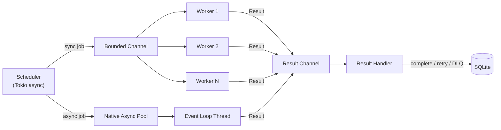

# Workers

Workers process queued jobs. taskito runs workers as OS threads within a single process, managed by a Rust scheduler.

## Starting a Worker

=== "CLI (Recommended)"

    ```bash
    taskito worker --app myapp.tasks:queue
    ```

    | Flag | Description |
    |---|---|
    | `--app` | Python path to your Queue instance (`module:attribute`) |
    | `--queues` | Comma-separated queue names (default: all registered) |

=== "Programmatic"

    ```python
    # Blocks the current thread
    queue.run_worker()

    # With specific queues
    queue.run_worker(queues=["emails", "reports"])
    ```

=== "Background Thread"

    ```python
    import threading

    t = threading.Thread(target=queue.run_worker, daemon=True)
    t.start()

    # Your application continues...
    ```

=== "Async"

    ```python
    import asyncio

    async def main():
        # Runs worker in a thread pool, non-blocking
        await queue.arun_worker()

    asyncio.run(main())
    ```

## Worker Count

By default, taskito auto-detects the number of CPU cores:

```python
queue = Queue(db_path="myapp.db", workers=0)  # Auto-detect (default)
queue = Queue(db_path="myapp.db", workers=8)  # Explicit count
```

## Prefork Pool

The default worker pool uses OS threads, which share a single Python GIL. For CPU-bound tasks, use the prefork pool — it spawns separate child processes, each with its own GIL:

```python
queue.run_worker(pool="prefork", app="myapp:queue", workers=4)
```

```bash
taskito worker --app myapp:queue --pool prefork
```

Each child is a full Python interpreter that imports your app, builds the task registry, and executes tasks independently.

### When to use prefork

| Workload | Pool | Why |
|----------|------|-----|
| I/O-bound (HTTP, DB) | `thread` (default) | Threads release the GIL during I/O |
| CPU-bound (data processing) | `prefork` | Each process has its own GIL |
| Mixed | `prefork` | CPU tasks benefit; I/O tasks work fine too |

### How it works



Jobs are serialized as JSON Lines over stdin pipes. Each child reads a job, executes the task wrapper (with middleware, resources, proxies), and writes the result as JSON to stdout. The parent's reader threads parse results and feed them to the scheduler.

### Configuration

| Parameter | Type | Default | Description |
|-----------|------|---------|-------------|
| `pool` | `str` | `"thread"` | Worker pool type: `"thread"` or `"prefork"` |
| `app` | `str` | — | Import path to Queue (required for prefork) |
| `workers` | `int` | CPU count | Number of child processes |

!!! note
    The `app` parameter must be an importable path like `"myapp.tasks:queue"`. Each child process imports this path to build its task registry. Tasks defined inside functions or closures cannot be imported by children.

## Worker Specialization

Tag workers to route jobs to specific machines or capabilities:

```python
# Start a worker that only processes jobs tagged for GPU or heavy workloads
queue.run_worker(tags=["gpu", "heavy"])
```

Jobs submitted to a queue with `tags` are only picked up by workers that have all the required tags. Workers without tags process untagged jobs.

```bash
# CLI equivalent
taskito worker --app myapp:queue --tags gpu,heavy
```

!!! note
    Workers are **OS threads**, not processes. Each worker acquires the Python GIL only during task execution, so the scheduler and dispatch logic run without GIL contention.

## Graceful Shutdown

taskito supports graceful shutdown via `Ctrl+C`:

1. **First `Ctrl+C`**: Stops accepting new jobs, waits for in-flight tasks to complete (up to `drain_timeout` seconds)
2. **Second `Ctrl+C`**: Force-kills immediately

Configure the drain timeout when constructing the queue:

```python
queue = Queue(db_path="myapp.db", drain_timeout=60)  # wait up to 60 seconds
```

The default `drain_timeout` is 30 seconds.

```
$ taskito worker --app myapp:queue
[taskito] Starting worker...
[taskito] Registered tasks: 3
[taskito] Queues: default, emails
^C
[taskito] Shutting down gracefully (waiting for in-flight jobs)...
[taskito] Worker stopped.
```

### Programmatic Shutdown

```python
# From another thread or signal handler
queue._inner.request_shutdown()
```

## Async Tasks

`async def` task functions are dispatched natively — they run on a dedicated event loop thread, not wrapped in `asyncio.run()` on a worker thread.

```python
@queue.task()
async def fetch_data(url: str) -> dict:
    import httpx
    async with httpx.AsyncClient() as client:
        r = await client.get(url)
        return r.json()
```

Control the max number of async tasks running concurrently:

```python
queue = Queue(
    db_path="myapp.db",
    workers=4,              # OS threads for sync tasks
    async_concurrency=200,  # concurrent async tasks (default: 100)
)
```

See [Native Async Tasks](async-tasks.md) for the full guide.

## How Workers Work



1. The **scheduler** runs in a dedicated Tokio async thread, polling SQLite for ready jobs every 50ms
2. Sync jobs are sent to the **worker thread pool** via a bounded crossbeam channel; each worker acquires the GIL and runs the Python function
3. Async jobs are dispatched to the **native async pool** and scheduled on a dedicated Python event loop
4. Results from both pools flow back through a **result channel** to the main loop
5. The main loop updates job status in SQLite (complete, retry, or DLQ)
