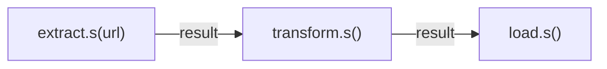
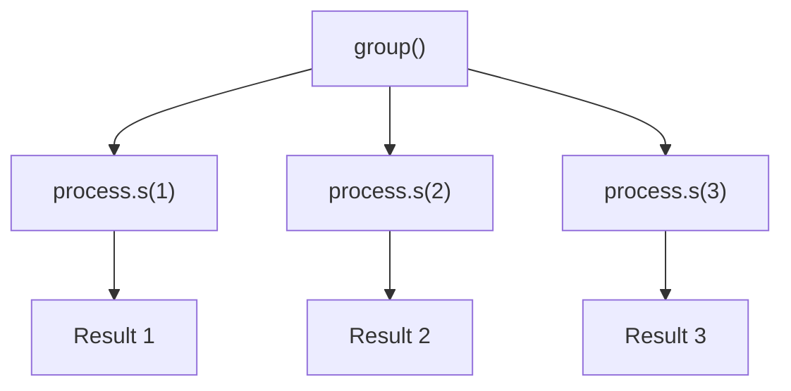
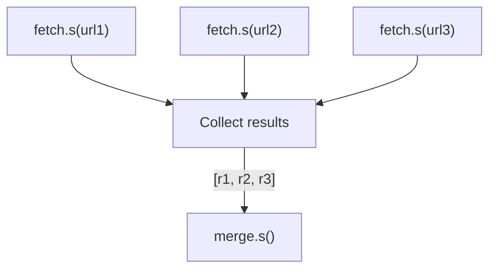

# Workflows

taskito provides three composition primitives for building complex task pipelines: **chain**, **group**, and **chord**.

## Signatures

A `Signature` wraps a task call for deferred execution. Create them with `.s()` or `.si()`:

```python
from taskito import chain, group, chord

# Mutable signature — receives previous result as first argument
sig = add.s(1, 2)

# Immutable signature — ignores previous result
sig = add.si(1, 2)
```

## Chain

Execute tasks **sequentially**, piping each result as the first argument to the next task:



```python
@queue.task()
def extract(url):
    return requests.get(url).json()

@queue.task()
def transform(data):
    return [item["name"] for item in data]

@queue.task()
def load(names):
    db.insert_many(names)
    return len(names)

# Build and execute the pipeline
result = chain(
    extract.s("https://api.example.com/users"),
    transform.s(),
    load.s(),
).apply(queue)

print(result.result(timeout=30))  # Number of records loaded
```

!!! tip
    Use `.si()` (immutable signatures) when a step should **not** receive the previous result:

    ```python
    chain(
        step_a.s(input_data),
        step_b.si(independent_data),  # Ignores step_a's result
        step_c.s(),
    ).apply(queue)
    ```

## Group

Execute tasks **in parallel** (fan-out):



```python
@queue.task()
def process(item_id):
    return fetch_and_process(item_id)

# Enqueue all three in parallel
jobs = group(
    process.s(1),
    process.s(2),
    process.s(3),
).apply(queue)

# Collect results
results = [j.result(timeout=30) for j in jobs]
```

## Chord

Fan-out with a **callback** — execute tasks in parallel, then pass all results to a final task:



```python
@queue.task()
def fetch(url):
    return requests.get(url).json()

@queue.task()
def merge(results):
    combined = {}
    for r in results:
        combined.update(r)
    return combined

# Fetch in parallel, then merge
result = chord(
    group(
        fetch.s("https://api1.example.com"),
        fetch.s("https://api2.example.com"),
        fetch.s("https://api3.example.com"),
    ),
    merge.s(),
).apply(queue)

print(result.result(timeout=60))
```

## Real-World Example: ETL Pipeline

```python
# Extract from multiple sources in parallel,
# transform each, then load all results
pipeline = chord(
    group(
        chain(extract.s(source), transform.s())
        for source in data_sources
    ),
    load.s(),
)

result = pipeline.apply(queue)
```
