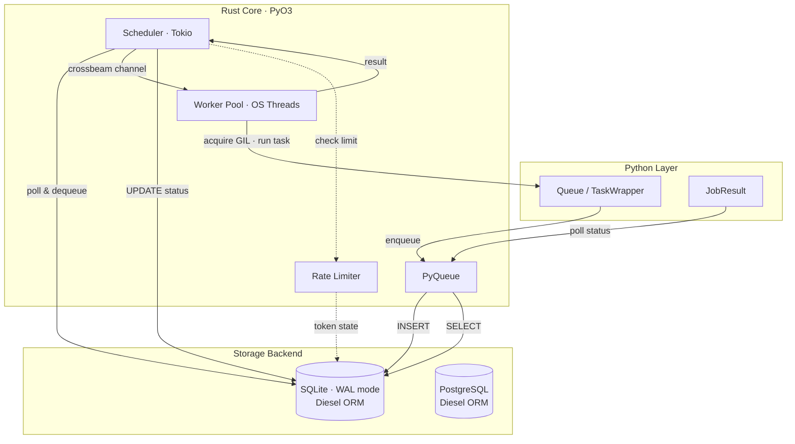

# taskito

**Rust-powered task queue for Python. No broker required — just SQLite or Postgres.**

```bash
pip install taskito
```

---

## 5-Minute Quickstart

```python
from taskito import Queue

queue = Queue(db_path="tasks.db")

@queue.task()
def add(a: int, b: int) -> int:
    return a + b

job = add.delay(2, 3)

# Start worker (in production, use the CLI instead)
import threading
t = threading.Thread(target=queue.run_worker, daemon=True)
t.start()

print(job.result(timeout=10))  # 5
```

[:octicons-arrow-right-24: Get started](getting-started/quickstart.md)

---

## Why taskito?

Most Python task queues require a separate broker (Redis, RabbitMQ) that you need to install, configure, monitor, and keep running. **taskito** embeds everything into a single SQLite file — the queue, the results, the rate limits, the schedules. Just `pip install` and go.

The core engine is written in **Rust** for performance: job dispatch, retry scheduling, rate limiting, and storage all happen in compiled native code. Python only runs during actual task execution.

---

## Features

<div class="grid cards" markdown>

-   :material-lightning-bolt:{ .lg .middle } **Zero Infrastructure**

    ---

    No Redis, no RabbitMQ — just a SQLite file. Install and start queuing in seconds.

-   :material-sort-ascending:{ .lg .middle } **Priority Queues**

    ---

    Higher priority jobs run first. Override at enqueue time for urgent work.

-   :material-refresh:{ .lg .middle } **Retry with Backoff**

    ---

    Automatic exponential backoff with jitter. Failed jobs land in a dead letter queue for inspection.

-   :material-speedometer:{ .lg .middle } **Rate Limiting**

    ---

    Token bucket rate limiting per task. `"100/m"`, `"10/s"`, `"3600/h"`.

-   :material-link-variant:{ .lg .middle } **Task Workflows**

    ---

    Compose pipelines with `chain`, parallelize with `group`, aggregate with `chord`.

-   :material-clock-outline:{ .lg .middle } **Cron Scheduling**

    ---

    `@queue.periodic(cron="0 */5 * * * *")` for recurring tasks with 6-field cron expressions.

-   :material-progress-check:{ .lg .middle } **Progress Tracking**

    ---

    Report progress from inside tasks. Monitor completion percentage in real time.

-   :material-language-rust:{ .lg .middle } **Rust-Powered**

    ---

    Scheduling, storage, and dispatch in native Rust. Python only runs your task code.

-   :material-database:{ .lg .middle } **Postgres Backend**

    ---

    Optional PostgreSQL storage for multi-machine workers with the same API.

-   :material-layers-outline:{ .lg .middle } **Per-task Middleware**

    ---

    `TaskMiddleware` with `before`/`after`/`on_retry` hooks for cross-cutting concerns.

-   :material-bell-outline:{ .lg .middle } **Events & Webhooks**

    ---

    Subscribe to job lifecycle events in-process or deliver them as signed HTTP webhooks.

</div>

---

## Integrations

Install optional extras to unlock additional capabilities:

<div class="grid cards" markdown>

-   :material-language-python:{ .lg .middle } **Flask**

    ---

    `pip install taskito[flask]` — `Taskito(app)` extension with CLI commands

-   :material-api:{ .lg .middle } **FastAPI**

    ---

    `pip install taskito[fastapi]` — `TaskitoRouter` for instant REST API

-   :material-cube-outline:{ .lg .middle } **Django**

    ---

    `pip install taskito[django]` — Admin integration and management commands

-   :material-chart-line:{ .lg .middle } **Prometheus**

    ---

    `pip install taskito[prometheus]` — Metrics middleware and `/metrics` endpoint

-   :material-radar:{ .lg .middle } **Sentry**

    ---

    `pip install taskito[sentry]` — Auto error capture with task context tags

-   :material-telescope:{ .lg .middle } **OpenTelemetry**

    ---

    `pip install taskito[otel]` — Distributed tracing with span-per-task

-   :material-database:{ .lg .middle } **Postgres**

    ---

    `pip install taskito[postgres]` — Multi-machine workers via PostgreSQL

-   :material-lock:{ .lg .middle } **Encryption**

    ---

    `pip install taskito[encryption]` — `EncryptedSerializer` for payload encryption

</div>

---

## Architecture



[:octicons-arrow-right-24: Architecture deep dive](architecture.md)

---

## Comparison

| Feature | taskito | Celery | RQ | Dramatiq | Huey |
|---|---|---|---|---|---|
| Broker required | **No** | Redis/RabbitMQ | Redis | Redis/RabbitMQ | Redis |
| Core language | Rust + Python | Python | Python | Python | Python |
| Priority queues | :white_check_mark: | :white_check_mark: | :x: | :x: | :white_check_mark: |
| Rate limiting | :white_check_mark: | :white_check_mark: | :x: | :white_check_mark: | :x: |
| Dead letter queue | :white_check_mark: | :x: | :white_check_mark: | :x: | :x: |
| Task dependencies | :white_check_mark: | :x: | :x: | :x: | :x: |
| Task workflows | :white_check_mark: | :white_check_mark: | :x: | :white_check_mark: | :x: |
| Per-task middleware | :white_check_mark: | :x: | :x: | :white_check_mark: | :x: |
| Job cancellation | :white_check_mark: | :white_check_mark: | :x: | :x: | :white_check_mark: |
| Cancel running tasks | :white_check_mark: | :white_check_mark: | :x: | :x: | :x: |
| Progress tracking | :white_check_mark: | :white_check_mark: | :x: | :x: | :x: |
| Unique tasks | :white_check_mark: | :x: | :x: | :x: | :white_check_mark: |
| Custom serializers | :white_check_mark: | :white_check_mark: | :x: | :x: | :x: |
| Postgres backend | :white_check_mark: | :white_check_mark: | :x: | :x: | :x: |
| Setup complexity | `pip install` | Broker + backend | Redis server | Broker | Redis server |

[:octicons-arrow-right-24: Full comparison](comparison.md)
