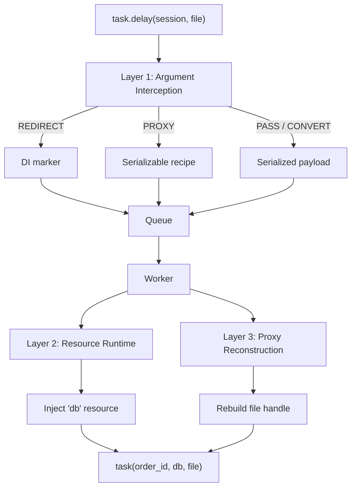

# Resource System

The resource system gives tasks clean access to external dependencies — database connections, HTTP clients, cloud clients — without passing live objects through the queue. It operates in three layers that together solve a fundamental distributed systems problem: task arguments must be serializable, but most real-world dependencies are not.



**Layer 1 — Argument Interception** classifies each value passed to `.delay()` before serialization. Database sessions become DI markers, file handles become recipes, safe primitives pass through unchanged, and non-serializable types like locks are rejected with a helpful error.

**Layer 2 — Worker Resource Runtime** manages long-lived objects initialized once at worker startup. Resources are injected into tasks by name — no serialization needed, no connection per task.

**Layer 3 — Resource Proxies** handles objects that have capturable state: file handles, HTTP sessions, cloud clients. The interceptor extracts a recipe; the worker rebuilds the live object before the task runs.

## Minimal end-to-end example

```python
from taskito import Queue, Inject
from sqlalchemy import create_engine
from sqlalchemy.orm import sessionmaker

queue = Queue(db_path="tasks.db", interception="strict")


@queue.worker_resource("db")
def create_db():
    engine = create_engine("postgresql://localhost/myapp")
    return sessionmaker(engine)


@queue.task()
def process_order(order_id: int, db: Inject["db"]):
    session = db()
    try:
        order = session.get(Order, order_id)
        order.status = "processed"
        session.commit()
    finally:
        session.close()
```

Enqueue from anywhere in your application:

```python
process_order.delay(42)
# The integer 42 passes through serialization normally.
# 'db' is injected by the worker — no session is ever put in the queue.
```

Start the worker:

```bash
taskito worker --app myapp.tasks:queue
# [taskito] Initialized 1 resource(s): db
# [taskito] Worker started with 8 threads
```

## Section overview

| Page | What it covers |
|---|---|
| [Argument Interception](interception.md) | Modes, strategies, custom types, `analyze()`, metrics |
| [Dependency Injection](dependency-injection.md) | `worker_resource()`, scopes, dependencies, teardown, health checks |
| [Resource Proxies](proxies.md) | Built-in handlers, HMAC signing, security, `NoProxy`, cloud handlers |
| [Configuration](configuration.md) | TOML config, pool tuning, frozen and reloadable resources, hot reload |
| [Testing](testing.md) | `test_mode(resources=)`, `MockResource`, pytest fixtures |
| [Observability](observability.md) | Prometheus metrics, dashboard endpoints, CLI commands |
