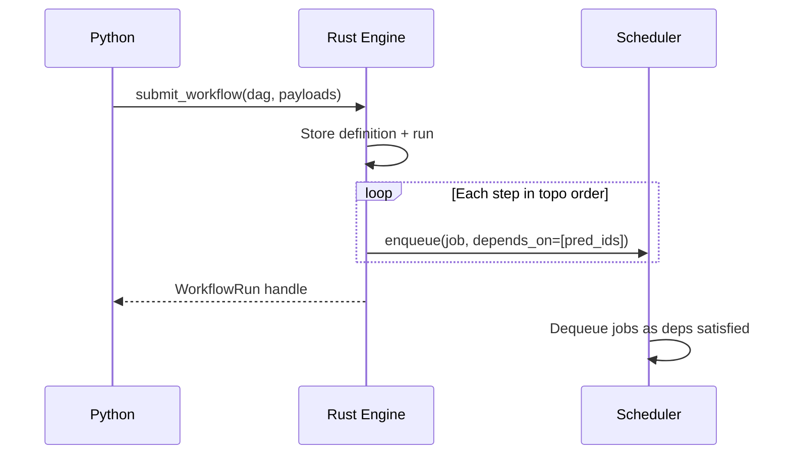
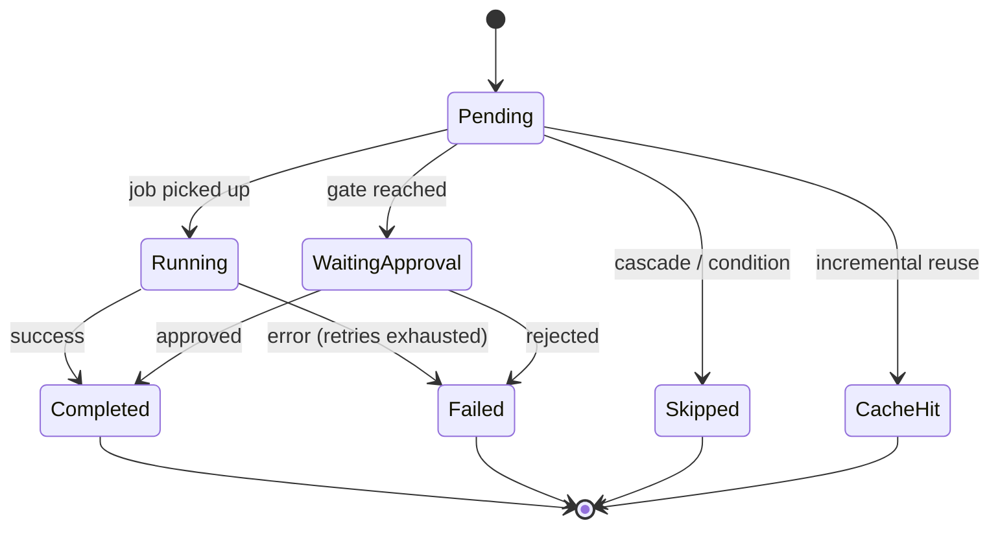

# Building Workflows

A workflow is a DAG of steps. Each step wraps a registered task. The engine creates jobs in topological order with `depends_on` chains so the existing scheduler handles execution.

## Defining steps

```python
from taskito.workflows import Workflow

wf = Workflow(name="etl", version=1)
wf.step("extract", extract_task)
wf.step("transform", transform_task, after="extract")
wf.step("load", load_task, after="transform")
```

Steps are added in order. The `after` parameter declares predecessors — a step won't run until all its predecessors complete.

### Multiple predecessors

```python
wf.step("merge", merge_task, after=["branch_a", "branch_b"])
```

### Step arguments

```python
wf.step("fetch", fetch_task, args=("https://api.example.com",))
wf.step("process", process_task, after="fetch", kwargs={"mode": "strict"})
```

Arguments are serialized at submission time using the queue's serializer.

## Step configuration

| Parameter | Type | Default | Description |
|-----------|------|---------|-------------|
| `name` | `str` | required | Unique step name within the workflow |
| `task` | `TaskWrapper` | required | Registered `@queue.task()` function |
| `after` | `str \| list[str]` | `None` | Predecessor step(s) |
| `args` | `tuple` | `()` | Positional arguments |
| `kwargs` | `dict` | `None` | Keyword arguments |
| `queue` | `str` | `None` | Override queue name |
| `max_retries` | `int` | `None` | Override retry count |
| `timeout_ms` | `int` | `None` | Override timeout (milliseconds) |
| `priority` | `int` | `None` | Override priority |

## Workflow decorator

Register reusable workflow factories with `@queue.workflow()`:

```python
@queue.workflow("nightly_etl")
def etl_pipeline():
    wf = Workflow()
    wf.step("extract", extract)
    wf.step("load", load, after="extract")
    return wf

# Build and submit
run = etl_pipeline.submit()
run.wait()

# Or build without submitting
wf = etl_pipeline.build()
print(wf.step_names)  # ["extract", "load"]
```

## Submitting

```python
run = queue.submit_workflow(wf)
```

This creates a `WorkflowRun` handle. Under the hood:

1. A `WorkflowDefinition` is stored (or reused by name + version)
2. A `WorkflowRun` record is created
3. For each step in topological order, a job is enqueued with `depends_on` chains
4. The run transitions to `RUNNING`



## Workflow parameters

| Parameter | Type | Default | Description |
|-----------|------|---------|-------------|
| `name` | `str` | `"workflow"` | Workflow name |
| `version` | `int` | `1` | Version number |
| `on_failure` | `str` | `"fail_fast"` | Error strategy: `"fail_fast"` or `"continue"` |
| `cache_ttl` | `float` | `None` | Cache TTL in seconds for [incremental runs](caching.md) |

## Node statuses

Each step transitions through these states:



| Status | Terminal | Meaning |
|--------|----------|---------|
| `PENDING` | No | Waiting for predecessors or job creation |
| `RUNNING` | No | Job is executing |
| `COMPLETED` | Yes | Step succeeded |
| `FAILED` | Yes | Step failed after retries exhausted |
| `SKIPPED` | Yes | Skipped due to failure cascade or unmet condition |
| `WAITING_APPROVAL` | No | Gate awaiting approve/reject |
| `CACHE_HIT` | Yes | Reused result from a prior run |
