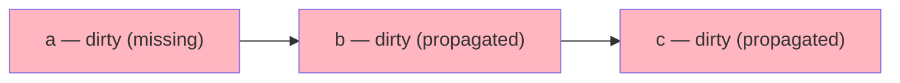
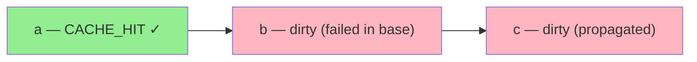

# Incremental Runs

Skip unchanged steps by reusing results from a prior run. When a node completed successfully in the base run, it gets `CACHE_HIT` status instead of re-executing.

## Basic usage

```python
# First run: everything executes, results hashed (SHA-256)
run1 = queue.submit_workflow(wf)
run1.wait()

# Second run: skip completed nodes from run1
run2 = queue.submit_workflow(wf, incremental=True, base_run=run1.id)
run2.wait()
```

Nodes that completed in `run1` with a stored result hash become `CACHE_HIT` in `run2`. Nodes that failed or are missing re-execute.

## Dirty-set propagation

If a node is dirty (failed or missing in the base run), all its downstream nodes are also dirty — even if they had cached results:





## Cache TTL

Set a time-to-live on cached results:

```python
wf = Workflow(name="pipeline", cache_ttl=3600)  # 1 hour
```

If the base run completed more than `cache_ttl` seconds ago, all nodes are treated as dirty (full re-execution).

## How it works

At submit time with `incremental=True`:

1. Fetch the base run's node data: `{name: (status, result_hash)}`
2. For each node in the new run:
    - Base node completed + has result_hash → `CACHE_HIT`
    - Base node failed / missing → dirty
    - Any predecessor dirty → also dirty (propagated)
3. `CACHE_HIT` nodes are created with `status=cache_hit` and `completed_at` set — no job enqueued
4. Dirty nodes get normal jobs

## Parameters

| Parameter | Type | Default | Description |
|-----------|------|---------|-------------|
| `incremental` | `bool` | `False` | Enable cache comparison |
| `base_run` | `str` | `None` | Run ID to compare against |
| `cache_ttl` | `float` | `None` | TTL in seconds (on `Workflow`) |
