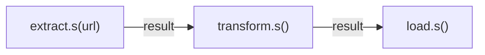

# Canvas Primitives

For simpler pipelines without DAG features, taskito provides **chain**, **group**, and **chord** — lightweight composition that doesn't require the workflow engine.

## Signatures

A `Signature` wraps a task call for deferred execution:

```python
from taskito import chain, group, chord

sig = add.s(1, 2)    # Mutable — receives previous result as first arg
sig = add.si(1, 2)   # Immutable — ignores previous result
```

## Chain

Execute tasks sequentially, piping each result to the next:



```python
result = chain(
    extract.s("https://api.example.com/users"),
    transform.s(),
    load.s(),
).apply(queue)

print(result.result(timeout=30))
```

!!! tip
    Use `.si()` when a step should **not** receive the previous result:

    ```python
    chain(
        step_a.s(input_data),
        step_b.si(independent_data),
        step_c.s(),
    ).apply(queue)
    ```

## Group

Execute tasks in parallel (fan-out):

```python
jobs = group(
    process.s(1),
    process.s(2),
    process.s(3),
).apply(queue)

results = [j.result(timeout=30) for j in jobs]
```

### Concurrency limits

```python
jobs = group(
    *[fetch.s(url) for url in urls],
    max_concurrency=5,
).apply(queue)
```

## Chord

Fan-out with a callback — run tasks in parallel, then pass all results to a final task:

```python
result = chord(
    group(
        fetch.s("https://api1.example.com"),
        fetch.s("https://api2.example.com"),
        fetch.s("https://api3.example.com"),
    ),
    merge.s(),
).apply(queue)
```

## chunks / starmap

```python
from taskito import chunks, starmap

# Batch processing — split 1000 items into groups of 100
results = chunks(process_batch, items, chunk_size=100).apply(queue)

# Map-reduce pattern
result = chord(
    chunks(process_batch, items, chunk_size=100),
    merge_results.s(),
).apply(queue)

# Tuple unpacking
results = starmap(add, [(1, 2), (3, 4), (5, 6)]).apply(queue)
```

## When to use canvas vs DAG workflows

| Feature | Canvas | DAG Workflows |
|---------|--------|---------------|
| Setup | No imports needed | `from taskito.workflows import Workflow` |
| Topology | Linear chains, flat groups | Arbitrary DAGs |
| Fan-out | Static (known at build time) | Dynamic (from return values) |
| Conditions | None | `on_success`, `on_failure`, `always`, callables |
| Error handling | Per-task retries only | Workflow-level strategies |
| Approval gates | No | Yes |
| Sub-workflows | No | Yes |
| Incremental runs | No | Yes |
| Status tracking | Per-job only | Per-workflow + per-node |
| Visualization | No | Mermaid / DOT |

Use canvas for quick one-off pipelines. Use DAG workflows for production pipelines that need monitoring, conditions, or complex topologies.
