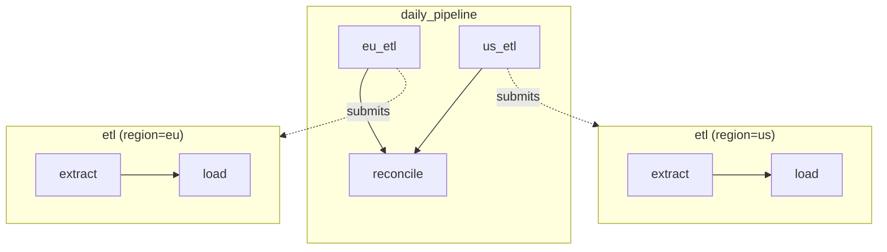

# Sub-Workflows & Scheduling

Nest workflows for composition, and schedule workflows on a cron.

## Sub-workflows

Use `WorkflowProxy.as_step()` to embed one workflow inside another:

```python
@queue.workflow("etl")
def etl_pipeline(region):
    wf = Workflow()
    wf.step("extract", extract, args=[region])
    wf.step("load", load, after="extract")
    return wf

@queue.workflow("daily")
def daily_pipeline():
    wf = Workflow()
    wf.step("eu_etl", etl_pipeline.as_step(region="eu"))
    wf.step("us_etl", etl_pipeline.as_step(region="us"))
    wf.step("reconcile", reconcile, after=["eu_etl", "us_etl"])
    return wf

run = daily_pipeline.submit()
```



### How it works

1. Parent workflow submits the child workflow via `queue.submit_workflow()` with `parent_run_id`
2. The child runs independently with its own nodes and status
3. When the child completes/fails, the tracker updates the parent node
4. Downstream steps in the parent evaluate normally

### Cancellation cascade

Cancelling the parent cascades to all active child workflows:

```python
run.cancel()  # Cancels parent + all child sub-workflows
```

### Failure

If a child workflow fails, the parent node is marked `FAILED`. Downstream steps follow the parent's `on_failure` strategy.

## Cron-scheduled workflows

Stack `@queue.periodic()` on top of `@queue.workflow()`:

```python
@queue.periodic(cron="0 0 2 * * *")    # 2:00 AM daily
@queue.workflow("nightly_analytics")
def nightly():
    wf = Workflow()
    wf.step("extract", extract_clickstream)
    wf.step("aggregate", build_dashboards, after="extract")
    return wf
```

Each cron trigger submits a new workflow run. Under the hood, a bridge task `_wf_launcher_nightly_analytics` is registered that calls `proxy.submit()`.

!!! note
    The `@queue.periodic()` decorator must be the **outer** decorator (applied second, listed first).
