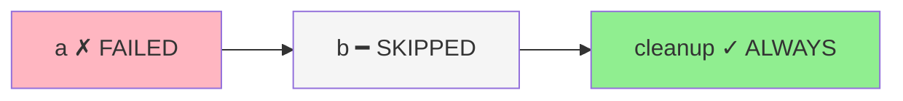

# Conditions & Error Handling

Control which steps execute based on predecessor outcomes, and configure how the workflow responds to failures.

## Step conditions

```python
wf.step("deploy", deploy, after="test")                           # default: on_success
wf.step("rollback", rollback, after="deploy", condition="on_failure")
wf.step("notify", send_slack, after="deploy", condition="always")
```

| Condition | Runs when |
|-----------|-----------|
| `None` / `"on_success"` | All predecessors completed successfully |
| `"on_failure"` | Any predecessor failed |
| `"always"` | Predecessors are terminal (regardless of outcome) |
| `callable` | `condition(ctx)` returns `True` |

## Callable conditions

Pass a function that receives a `WorkflowContext`:

```python
from taskito.workflows import WorkflowContext

def high_score(ctx: WorkflowContext) -> bool:
    return ctx.results["validate"]["score"] > 0.95

wf.step("deploy", deploy, after="validate", condition=high_score)
```

`WorkflowContext` fields:

| Field | Type | Description |
|-------|------|-------------|
| `run_id` | `str` | Workflow run ID |
| `results` | `dict[str, Any]` | Deserialized return values of completed nodes |
| `statuses` | `dict[str, str]` | Status strings for all terminal nodes |
| `failure_count` | `int` | Number of failed nodes |
| `success_count` | `int` | Number of completed nodes |

## Error strategies

Set the workflow-level error strategy:

=== "Fail Fast (default)"

    ```python
    wf = Workflow(name="strict", on_failure="fail_fast")
    ```

    One failure skips **all** pending steps. The workflow transitions to `FAILED`.

    ```mermaid
    graph LR
        A["a ✓"] --> B["b ✗"]
        B --> C["c ━ SKIPPED"]
        B --> D["d ━ SKIPPED"]
        style B fill:#FFB6C1
        style C fill:#F5F5F5
        style D fill:#F5F5F5
    ```

=== "Continue"

    ```python
    wf = Workflow(name="resilient", on_failure="continue")
    ```

    Failed steps skip their `on_success` dependents, but **independent branches keep running**.

    ```mermaid
    graph TD
        root["root ✓"] --> fail_branch["fail ✗"]
        root --> ok_branch["ok ✓"]
        fail_branch --> after_fail["after_fail ━ SKIPPED"]
        ok_branch --> after_ok["after_ok ✓"]
        style fail_branch fill:#FFB6C1
        style after_fail fill:#F5F5F5
        style after_ok fill:#90EE90
    ```

## Skip propagation

When a node is skipped, its successors are evaluated recursively:

- `on_success` successors → **SKIPPED** (predecessor didn't succeed)
- `on_failure` successors → evaluated (predecessor is terminal)
- `always` successors → **run** regardless of how the predecessor ended

```python
wf = Workflow(name="cleanup_pipeline")
wf.step("a", risky_task)
wf.step("b", next_step, after="a")                      # SKIPPED if a fails
wf.step("cleanup", cleanup, after="b", condition="always")  # runs even if b is skipped
```



## Combining conditions with fan-out

Conditions work with fan-out nodes. If a fan-out child fails:

```python
wf.step("fetch", fetch_data)
wf.step("process", process, after="fetch", fan_out="each")
wf.step("aggregate", aggregate, after="process", fan_in="all")
wf.step("on_error", alert, after="process", condition="on_failure")
```

If any `process[i]` child fails, the fan-out parent is marked `FAILED`, `aggregate` is skipped, and `on_error` runs.
