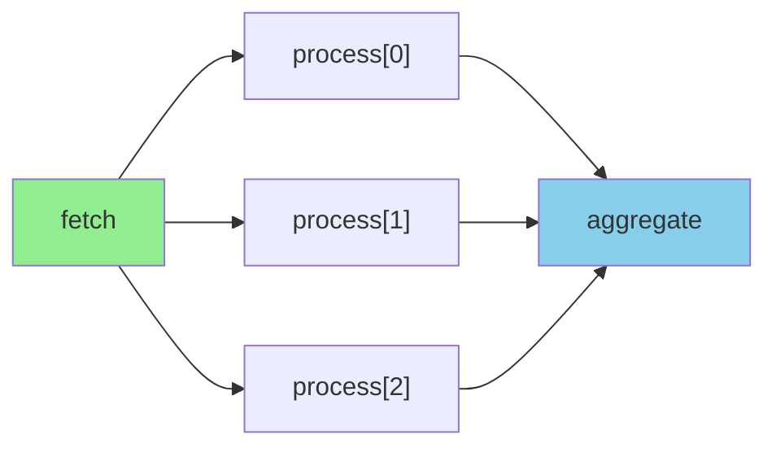
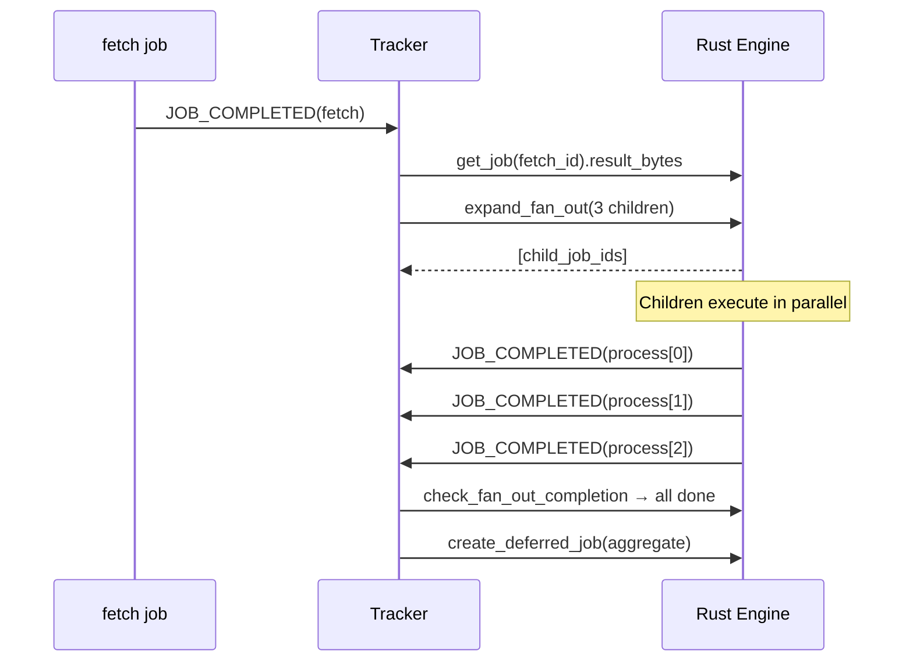

# Fan-Out & Fan-In

Split a step's result into parallel child jobs, then collect all results into a downstream step.



## Fan-out with `"each"`

The predecessor's return value must be iterable. Each element becomes a separate child job:

```python
@queue.task()
def fetch() -> list[int]:
    return [10, 20, 30]

@queue.task()
def process(item: int) -> int:
    return item * 2

@queue.task()
def aggregate(results: list[int]) -> int:
    return sum(results)  # receives [20, 40, 60]

wf = Workflow(name="map_reduce")
wf.step("fetch", fetch)
wf.step("process", process, after="fetch", fan_out="each")
wf.step("aggregate", aggregate, after="process", fan_in="all")
```

Child nodes are named `process[0]`, `process[1]`, `process[2]` and appear in status queries.

## How it works

1. `fetch` completes — the tracker reads its return value
2. `apply_fan_out("each", result)` splits the list into individual items
3. `expand_fan_out()` creates N child nodes + N jobs (no `depends_on` — they're ready immediately)
4. Each child runs independently in parallel
5. When all children complete, `check_fan_out_completion()` marks the parent
6. The tracker collects all child results in index order
7. The fan-in job is created with `((results_list,), {})` as its payload



## Empty fan-out

If the predecessor returns an empty list, the fan-out parent is marked `COMPLETED` immediately with zero children, and the fan-in receives an empty list:

```python
@queue.task()
def fetch() -> list:
    return []  # nothing to process

# aggregate receives []
```

## Fan-out with downstream steps

Steps after the fan-in work normally:

```python
wf = Workflow(name="full_pipeline")
wf.step("fetch", fetch)
wf.step("process", process, after="fetch", fan_out="each")
wf.step("aggregate", aggregate, after="process", fan_in="all")
wf.step("report", send_report, after="aggregate")  # runs after aggregate
```

## Failure handling

By default (`on_failure="fail_fast"`), if any fan-out child fails:

- Remaining pending children are cancelled
- The fan-out parent is marked `FAILED`
- The fan-in and downstream steps are `SKIPPED`
- The workflow transitions to `FAILED`

Combine with [conditions](conditions.md) for more control:

```python
wf.step("handle_error", alert, after="process", condition="on_failure")
```
