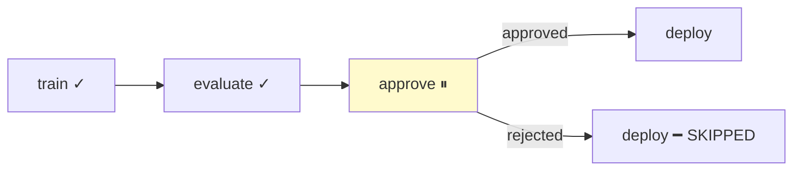

# Approval Gates

Pause a workflow for human review. The gate enters `WAITING_APPROVAL` status until explicitly approved or rejected — or until a timeout fires.



## Adding a gate

```python
wf = Workflow(name="ml_deploy")
wf.step("train", train_model)
wf.step("evaluate", evaluate, after="train")
wf.gate("approve", after="evaluate")
wf.step("deploy", deploy, after="approve")
```

When the workflow reaches the gate, it pauses. Downstream steps won't execute until the gate is resolved.

## Resolving a gate

```python
run = queue.submit_workflow(wf)

# Later, after review:
queue.approve_gate(run.id, "approve")   # → gate COMPLETED, deploy runs
# or:
queue.reject_gate(run.id, "approve")    # → gate FAILED, deploy SKIPPED
```

## Timeout

Auto-resolve after a deadline:

```python
wf.gate("approve", after="evaluate",
        timeout=86400,         # 24 hours
        on_timeout="reject")   # or "approve"
```

| Parameter | Type | Default | Description |
|-----------|------|---------|-------------|
| `timeout` | `float` | `None` | Seconds until auto-resolve. `None` waits forever |
| `on_timeout` | `str` | `"reject"` | Action on expiry: `"approve"` or `"reject"` |
| `message` | `str` | `None` | Human-readable message for approvers |

## Gate with conditions

Gates respect step conditions:

```python
wf.step("test", run_tests)
wf.gate("approve", after="test", condition="on_success")
wf.step("deploy", deploy, after="approve")
```

If `test` fails, the gate is skipped (condition not met), and `deploy` is also skipped.

## Events

When a gate enters `WAITING_APPROVAL`, a `WORKFLOW_GATE_REACHED` event fires:

```python
@queue.on(EventType.WORKFLOW_GATE_REACHED)
def notify_team(event_type, payload):
    send_slack(f"Workflow {payload['run_id']} needs approval at {payload['node_name']}")
```
