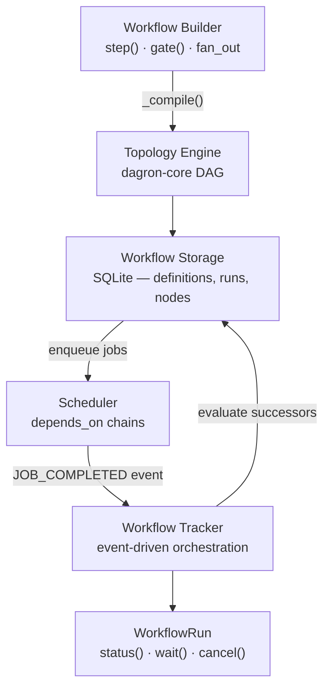

# Workflows

Build multi-step pipelines as directed acyclic graphs. Define steps, wire dependencies, and let taskito handle execution order, parallelism, failure propagation, and state tracking — all backed by a Rust engine with dagron-core for graph algorithms.



## Quick start

```python
from taskito import Queue
from taskito.workflows import Workflow

queue = Queue(db_path="tasks.db")

@queue.task()
def extract(): return fetch_data()

@queue.task()
def transform(data): return clean(data)

@queue.task()
def load(data): db.insert(data)

wf = Workflow(name="etl_pipeline")
wf.step("extract", extract)
wf.step("transform", transform, after="extract")
wf.step("load", load, after="transform")

run = queue.submit_workflow(wf)
result = run.wait(timeout=60)
print(result.state)  # WorkflowState.COMPLETED
```

## Section overview

| Page | What it covers |
|---|---|
| [Building Workflows](building.md) | `Workflow.step()`, decorator pattern, step configuration, DAG structure |
| [Fan-Out & Fan-In](fan-out.md) | Splitting results into parallel jobs, collecting with aggregation |
| [Conditions & Error Handling](conditions.md) | `on_success`, `on_failure`, `always`, callable conditions, `on_failure` modes |
| [Approval Gates](gates.md) | Human-in-the-loop pause/resume, timeout, approve/reject API |
| [Sub-Workflows & Scheduling](composition.md) | Nesting workflows, cron-scheduled runs |
| [Incremental Runs](caching.md) | Result hashing, `CACHE_HIT`, dirty-set propagation, TTL |
| [Analysis & Visualization](analysis.md) | Critical path, bottleneck analysis, Mermaid/DOT rendering |
| [Canvas Primitives](canvas.md) | Chain, group, chord — simple composition without DAGs |
